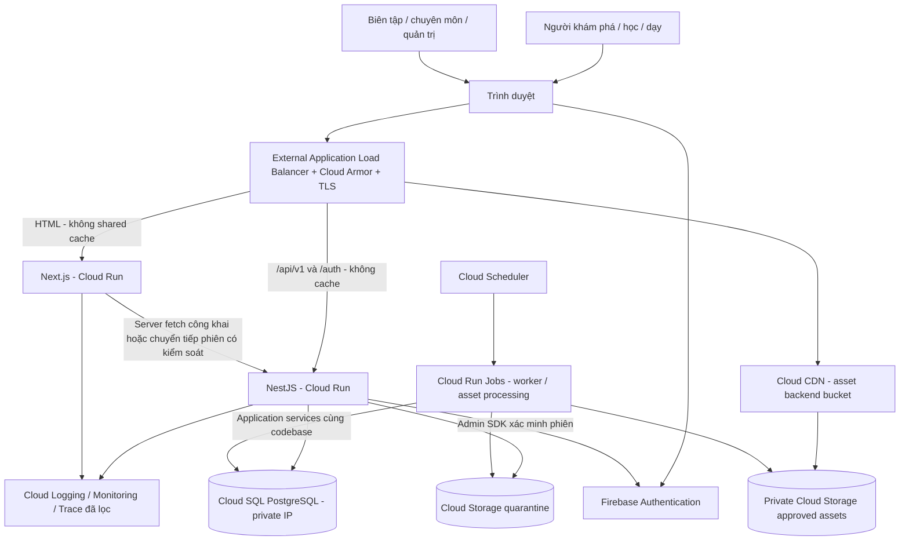
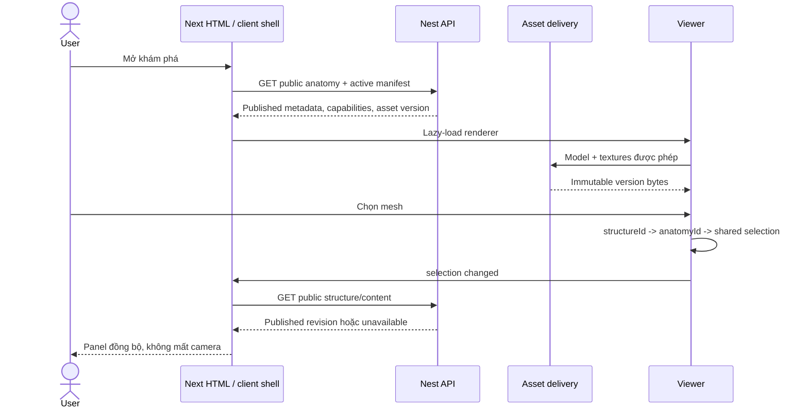

# System design

> **Cập nhật kiến trúc:** quyết định Firebase của owner thay phần PostgreSQL/Prisma/VM/Cloud SQL trong bản thiết kế ban đầu này. Xem [kế hoạch đã duyệt](implementation/firebase-migration-plan.md) và [runbook Firebase](../infra/firebase/README.md) cho cấu hình, lưu trữ, giới hạn giao dịch và triển khai hiện hành.


Trạng thái: PROPOSED. Không có dịch vụ/hạ tầng nào trong sơ đồ đã được tạo bởi công việc tài liệu này.

## 1. Ràng buộc kiến trúc

TypeScript strict xuyên suốt. Next.js App Router render nội dung công khai thành HTML; client viewer tải riêng. NestJS modular monolith sở hữu nghiệp vụ/authorization/validation. **Google Cloud + Firebase là nền tảng theo yêu cầu cập nhật của người dùng.** Cloud SQL for PostgreSQL là nguồn dữ liệu giao dịch; Prisma chỉ trong backend. Cloud Storage chứa binary; Cloud CDN phân phối tài nguyên được phép. Firebase Authentication cung cấp danh tính, Firebase Emulator Suite phục vụ test local. Không Java/Spring, microservices, Kubernetes hoặc Redis mặc định.

Giữ PostgreSQL/Prisma vì người dùng chưa yêu cầu đổi mô hình persistence. Chưa dùng Firestore, Realtime Database, Firebase Data Connect/SQL Connect hoặc Cloud Functions làm backend thứ hai; mọi nghiệp vụ vẫn ở NestJS. Firebase App Hosting/Hosting không nằm trên đường phục vụ web V1: Next chạy container trên Cloud Run để dùng chung routing/edge policy với Nest. Đó là lựa chọn triển khai đề xuất, không phải hạn chế của Firebase.

Phiên bản exact sẽ chốt trong compatibility spike trước khi scaffold: Node.js LTS còn hỗ trợ, pnpm, Next/React, Three/R3F/Drei, Nest/Prisma/PostgreSQL. Commit lockfile, pin package manager và image digest. Không dùng tag `latest`, beta/canary trong bản dựng phát hành. R3F yêu cầu major phù hợp React; tài liệu upstream nêu R3F 8/React 18 và R3F 9/React 19 — phải kiểm lại package metadata của phiên bản thực sự chọn, không chỉ dựa vào cặp ví dụ. [Nguồn R3F](https://github.com/pmndrs/react-three-fiber).

## 2. Context và container



Request `/api/v1/*` và `/auth/*` cùng origin với web; application session cookie host-only không chuyển cho domain asset riêng hay link ngoài. Trình duyệt đăng nhập Firebase, đổi ID token mới lấy thành session cookie tại Nest qua endpoint có CSRF protection; chi tiết ở 06. Next SSR chuyển tiếp đúng cookie đến Nest, không chép toàn bộ header người dùng. Không tin header `X-User` do client cung cấp. Firebase UID xác định danh tính; quyền owner/org/class nằm ở PostgreSQL và do Nest kiểm tra.

Public web/API qua load balancer dùng Cloud Run ingress `internal-and-cloud-load-balancing`; anonymous routes cần public invocation ở lớp Cloud Run nhưng private routes vẫn do Nest xác thực. IAM không thay application authorization. Kiểm direct `run.app` access không vượt ingress/Cloud Armor. SSR gọi cùng public origin qua edge ở V1; internal-only worker endpoints không công khai và cần service-account IAM/OIDC riêng. [Cloud Run ingress](https://docs.cloud.google.com/run/docs/securing/ingress).

## 3. Phân lớp và quyền sở hữu

| Module | Sở hữu | Không được làm |
| --- | --- | --- |
| Identity | Session, external identity mapping, role assignment | Định nghĩa nội dung y khoa |
| Organizations | Organization, class, membership và scope | Cho phép org admin tự thành medical reviewer |
| Anatomy | anatomyId, taxonomy, thuật ngữ, quan hệ | Dùng mesh name làm định danh nghiệp vụ |
| Assets | Version, license, mapping, capability và release | Publish binary trước khi đủ gate |
| MedicalContent | Revision, claim/source, review, publication | Cấp quyền truy cập lớp học |
| HealthcareDirectory | Branch, chuyên khoa, nguồn theo claim | Tự xếp hạng chất lượng điều trị |
| Learning | Lesson revision, scene, quiz, attempt, progress | Ghi trực tiếp bảng nội dung của module khác |
| Audit | Sự kiện nghiệp vụ append-only đã redaction | Lưu nội dung ghi chú/triệu chứng/token |

Request → controller DTO validation → application service → domain rules → repository/Prisma. Module gọi service được export hoặc domain event đã định nghĩa; không đọc repository riêng của module khác. Audit nằm trong cùng transaction với mutation quan trọng. Không nhân bản nghiệp vụ bằng Next server actions. OpenAPI là hợp đồng API, generated client không thay runtime validation.

## 4. Monorepo đề xuất

```text
apps/web/                   Next routes, SSR, app composition
apps/api/src/modules/       Nest modules nói trên
packages/ui/                Tokens, components, product copy primitives
packages/anatomy-viewer/    Renderer, adapter, state, scene contracts
packages/api-client/        Client sinh từ OpenAPI, không sửa trực tiếp
packages/config/            TS/lint/test cấu hình chung
infra/docker/               Images, Compose local
infra/terraform/            Google Cloud + Firebase theo môi trường, chưa provision
infra/firebase/             Emulator config, rules và project aliases, chưa tạo
docs/                       Specs, ADR, evidence/runbooks
```

Không tạo shared package thành nơi chứa toàn bộ domain. Các type scene thuần dữ liệu có schema runtime và version, không import Nest/Prisma vào browser. ESLint/import boundaries và CI dependency graph sẽ kiểm tra ranh giới.

## 5. Luồng mở viewer và chọn cấu trúc



Không cho animation phụ thuộc latency API từng frame. Abort tải vùng cũ khi đổi cấu trúc; generation ID chặn response cũ. Selection state ở viewer store; server data ở TanStack Query. URL chứa slug public nếu người dùng chủ động mở trang cấu trúc, không chứa lịch sử khám phá riêng.

## 6. Cache, publication và thu hồi

**Quyết định V1 đề xuất:** HTML/API y khoa, cơ sở, manifest và private data không cache ở shared CDN; Next fetch/render tương ứng dùng cơ chế no-store phù hợp phiên bản được chọn. Không dùng ISR cho nội dung cần rút ngay ở giai đoạn đầu. Static JS/CSS có content hash được cache dài. Private response `Cache-Control: private, no-store`; cookie và Authorization không nằm trong public cache key vì các route này bypass cache hoàn toàn.

Asset binary bất biến theo version/hash. Cloud Storage bucket private, uniform bucket-level access và public access prevention; Cloud CDN service identity chỉ được đọc approved bucket theo IAM tối thiểu. Nest cấp Cloud CDN signed URL TTL đề xuất ≤5 phút sau kiểm license/entitlement; export/download chỉ nếu license cho phép. Không dùng Firebase download token URL lâu dài cho model hạn chế quyền. Signed URL CDN không phải GCS signed URL: API/import upload dùng GCS grant riêng, không tái sử dụng khóa/phạm vi.

**Có signing key không đồng nghĩa chặn mọi unsigned request.** Cần kiểm bucket private, CDN cache behavior và cả URL thiếu/sai/hết chữ ký ở trạng thái cold/warm cache; không cho path public thay thế vượt gate. IAM bảo vệ origin và chữ ký cấp quyền delivery là hai lớp riêng. [Cloud CDN signed URLs](https://docs.cloud.google.com/cdn/docs/using-signed-urls).

Cloud Storage for Firebase dùng bucket Google Cloud Storage, nhưng V1 không cho browser SDK đọc/ghi trực tiếp domain data/model. Nếu gắn bucket qua Firebase, Security Rules mặc định deny client reads/writes; Admin SDK/GCS access cần IAM và authorization Nest vì không được bảo vệ bằng client Rules. Firebase session cookie không phải credential dùng trực tiếp cho Storage SDK. [Firebase Storage Security Rules](https://firebase.google.com/docs/storage/security).

Thu hồi: transaction đổi publication/asset status → outbox event → ngừng cấp capability → chặn object path ở origin/delivery → invalidate CDN liên quan → xác minh từ nhiều điểm truy cập. Viewer revalidate manifest mỗi 60 giây và khi tab foreground; nếu không xác minh được quyền, dừng tải mới/mô phỏng bị hạn chế. File đã tải xuống máy người dùng không thể bảo đảm thu hồi; phải ghi vào review bản quyền. Không chọn license đòi remote erase mà thiết kế không đáp ứng.

Khi mở rộng nhiều Next instances, cache/revalidation phải được thiết kế thống nhất trước khi bật caching; không cho replica tự giữ bản y khoa cũ. [Next self-hosting](https://nextjs.org/docs/app/guides/self-hosting).

## 7. Transaction và công việc bất đồng bộ

Publish content, approval, save lesson revision, revoke share dùng transaction ngắn. Optimistic concurrency bằng revision/If-Match; unique constraint cho idempotency theo actor + operation + key. Retry cùng key nhưng payload khác trả conflict.

Outbox lưu cùng transaction cho tác vụ sau commit: thu hồi CDN, xuất/xóa dữ liệu, thông báo nội bộ nếu được triển khai. Worker đọc bằng lease/lock có hạn, retry exponential backoff có jitter, số lần hữu hạn; task thất bại cần trạng thái/operator retry. Consumer idempotent theo event ID; không hứa exactly-once. Không log payload nhạy cảm. V1 dùng PostgreSQL outbox + Cloud Run Job hữu hạn từ cùng codebase; Cloud Scheduler đánh thức theo chu kỳ đề xuất 1 phút, job chồng nhau phải an toàn nhờ lease. Không chạy polling loop dựa vào CPU background của Cloud Run service có thể scale-to-zero. Thu hồi quyền trong DB xảy ra đồng bộ trước ACK; phần purge bất đồng bộ có TTL/window được kiểm thử.

Cloud Tasks/Pub/Sub chưa là dependency mặc định; chỉ bổ sung khi latency hoặc throughput yêu cầu. Asset processing cũng chạy Cloud Run Job với app-service layer và quyền DB/storage riêng, không gọi vòng qua public admin API. Scheduler/Jobs dùng service identity, không Firebase user token. [Cloud Run scheduled execution](https://docs.cloud.google.com/run/docs/triggering/using-scheduler).

Asset conversion chạy task cô lập CPU/memory/time, có queue record và status; không block API. Import batch dùng createMany/upsert theo batch giới hạn đã đo, transaction theo batch và restart checkpoint, không save từng hàng trong vòng lặp lớn. [Prisma transaction guidance](https://www.prisma.io/docs/orm/fundamentals/transactions).

## 8. Google Cloud + Firebase deployment đề xuất

Một region do owner chốt theo residency, latency, dịch vụ hỗ trợ và chi phí; không tự giả định region hợp lệ cho dữ liệu. Next và Nest là hai Cloud Run services; External Application Load Balancer với serverless NEGs, Cloud Armor và Certificate Manager; Cloud CDN chỉ trên backend asset phù hợp. Worker/conversion/migration là Cloud Run Jobs. Cloud SQL PostgreSQL private IP, regional HA cho production theo ngân sách; Direct VPC egress + TLS cho kết nối Prisma tới DB. Cloud Run/Cloud SQL nên cùng region. [Cloud SQL từ Cloud Run](https://docs.cloud.google.com/sql/docs/postgres/connect-run).

Artifact Registry lưu image digest; Secret Manager lưu server secrets; Cloud Logging/Monitoring/Trace nhận telemetry đã lọc; Cloud DNS và managed TLS phục vụ domain. Cloud Storage quarantine/approved/export tách quyền và lifecycle. Firebase Authentication bật trên từng project môi trường; provider đăng nhập cụ thể, authorized domains và MFA/Identity Platform tier được chốt ở P2. Không bật Firebase Analytics mặc định trên bề mặt có dữ liệu sức khỏe.

Dev/staging/prod là các Google Cloud projects riêng có Firebase tương ứng; DB/bucket/service accounts/keys tách biệt. Không public DB. Cloud Run max instances/concurrency/pool phải giới hạn tổng connection budget; min instances là quyết định theo SLO/cost, không giả định số replicas bảo đảm HA. Startup/liveness không lộ config hoặc gây restart dây chuyền khi DB lỗi; smoke dependency tách riêng. CI dùng GitHub OIDC qua Workload Identity Federation, service-account impersonation và environment approvals, không tải JSON private key. [Deployment federation](https://docs.cloud.google.com/iam/docs/workload-identity-federation-with-deployment-pipelines).

## 9. Capacity và mở rộng

Giả định lập kế hoạch, chưa phải forecast: 1.000 phiên xem đồng thời, 100 API reads/s, 10 writes/s, 20.000 lượt tải asset/ngày; cần đo lại trong pilot. Nếu trung bình 25MB/lượt, egress khoảng 500GB/ngày (~15TB/30 ngày, đơn vị thập phân), chưa tính hit/reload/texture thêm. Vì vậy asset budget/LOD/cache và hợp đồng CDN là yếu tố chi phí chính; không ước tính tiền khi chưa có region/giá/hợp đồng.

Scale web/API theo CPU/latency/request rate; connection pool tổng số replicas không vượt ngân sách DB. Dùng index trước read replica, đo trước cache. Chỉ thêm search engine khi truy vấn PostgreSQL/alias không đạt mục tiêu. Chỉ tách service khi có ranh giới đội ngũ/khối lượng/sự cố có bằng chứng.
