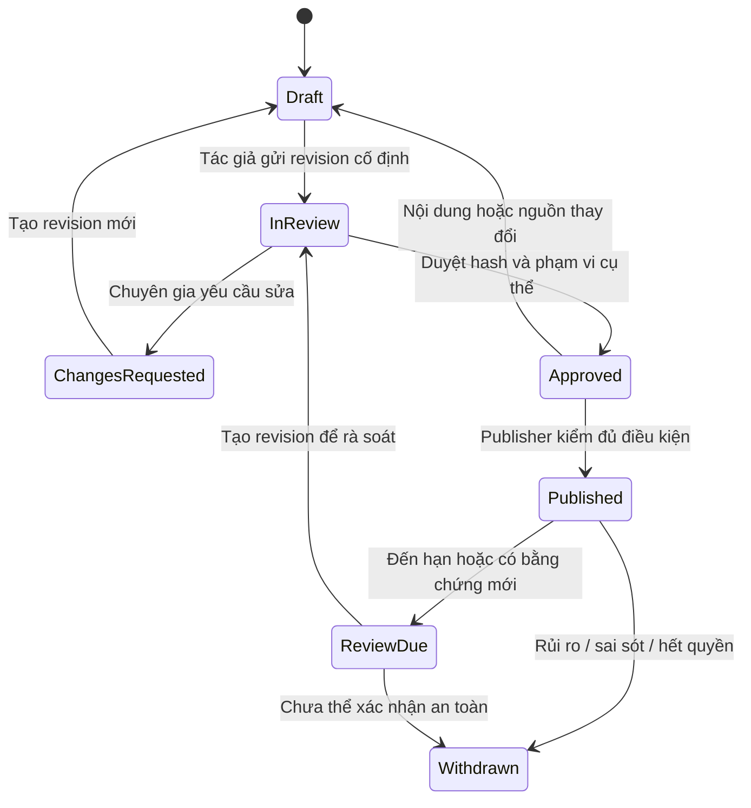

# Bảo mật, nội dung và quản trị dữ liệu

Trạng thái: thiết kế đề xuất, chưa có kiểm thử bảo mật hoặc ý kiến pháp lý cho sản phẩm. Tài liệu này quy định gate cần thực hiện, không tuyên bố tuân thủ pháp luật hay chứng nhận y khoa.

## 1. Phân loại và tối thiểu hóa dữ liệu

| Loại | Ví dụ | Lưu/chia sẻ mặc định |
| --- | --- | --- |
| Public đã duyệt | Bài kiến thức, thuật ngữ, hồ sơ cơ sở có nguồn | Chỉ revision published, quyền asset riêng |
| Editorial restricted | Bản nháp, reviewer notes, license hợp đồng | Chỉ nhóm được giao, không trong public DTO |
| Account/organization | External identity, membership, tiến độ | Chính chủ hoặc quyền lớp học có phạm vi |
| Private potentially sensitive | Ghi chú có thể chứa sức khỏe, bài chưa chia sẻ | Không public, không analytics, không search index công khai |
| Operational | Request latency, job status, audit metadata | Redaction, retention, truy cập hạn chế |

Không yêu cầu bệnh án để khám phá; không xây hồ sơ bệnh nhân. Search query chỉ xử lý tạm, không log/tracking định danh. Geolocation opt-in theo lần tra cứu, chỉ dùng tính khoảng cách, không lưu tọa độ chính xác mặc định. Session replay và ad pixel tắt trên khám phá/tìm kiếm/private routes; không gửi anatomy selection kèm account ID vào công cụ quảng cáo.

## 2. Auth và quyền

Firebase Authentication là nguồn danh tính. Client đăng nhập bằng provider được duyệt, dùng in-memory persistence; gửi ID token mới tới Nest `POST /auth/session` có CSRF/Origin protection. Nest dùng Admin SDK kiểm ID token/revocation và `auth_time` gần đây, tạo Firebase session cookie Secure/HttpOnly/SameSite phù hợp. Sau trao đổi, xóa client auth state; không token trong localStorage. Firebase cookie là JWT đã ký, **không phải opaque session token**. [Firebase session cookies](https://firebase.google.com/docs/auth/admin/manage-cookies).

Thiết kế ứng dụng bổ sung Session registry trong PostgreSQL: hash cookie, userId/Firebase UID, expiresAt, idle deadline, revokedAt; không lưu raw token. Mỗi protected request kiểm `verifySessionCookie(cookie, true)`, registry còn hiệu lực và quyền owner/org/class hiện tại. Firebase verification outage trả dependency unavailable, không bỏ qua kiểm tra; anonymous reading vẫn hoạt động. Đăng xuất một thiết bị revoke registry entry + clear cookie; đăng xuất mọi thiết bị/xóa account revoke mọi registry entry và Firebase refresh tokens. Không dùng Firebase custom claims làm nguồn quyền lớp học duy nhất. Thời hạn idle/absolute và MFA cho admin/reviewer được security owner chốt trước beta; tính năng/tier Identity Platform cần kiểm tra trước cam kết.

Mutation dùng CSRF token + Origin validation; SameSite không là biện pháp duy nhất. Same-origin routing hạn chế CORS; không wildcard credentials. Rate limit theo route và actor/IP với privacy policy. API authorization dùng session + object owner/org/class + action, không tin tenantId trong body. Membership check lại cho mỗi protected request; grant quyền không dựa JWT role tồn tại quá lâu.

| Hành động | Guest | Learner | Instructor | Org admin | Editor | Reviewer | Publisher |
| --- | --- | --- | --- | --- | --- | --- | --- |
| Đọc published public | Có | Có | Có | Có | Có | Có | Có |
| Xem ghi chú cá nhân | Không | Chính chủ | Chính chủ | Chính chủ | Chính chủ | Chính chủ | Chính chủ |
| Lưu scene/bài | Không | Bộ sưu tập riêng theo giai đoạn | Bài của mình/phạm vi lớp | Chỉ khi có quyền instructor riêng | Không mặc định | Không mặc định | Không mặc định |
| Xem tiến độ lớp | Không | Chính mình | Lớp được giao | Theo policy tổ chức đã duyệt | Không | Không | Không |
| Quản lý thành viên | Không | Không | Không mặc định | Trong org | Không | Không | Không |
| Sửa nội dung y khoa | Không | Không | Không | Không | Có | Góp ý, không sửa lén bản duyệt | Không mặc định |
| Duyệt y khoa | Không | Không | Không | Không | Không tự duyệt | Đúng chuyên môn, khác tác giả | Không mặc định |
| Publish/withdraw | Không | Không | Không | Không | Không | Không mặc định | Đúng revision đủ gate |

Platform admin quản trị vận hành, không mặc nhiên có quyền đọc ghi chú hay duyệt y khoa. Break-glass nếu cần phải có quy trình riêng, lý do, thời hạn, audit và người phê duyệt. Không implement trước khi owner chốt.

## 3. Mô hình đe dọa ưu tiên

| Rủi ro | Kiểm soát | Bằng chứng phải có |
| --- | --- | --- |
| IDOR/cross-tenant | Object policy, composite FK, scope query bắt buộc | Token org A đọc/ghi mọi object org B bị chặn |
| XSS qua note/article/GLTF metadata | Sanitization allowlist, CSP, không execute MDX tùy ý | Payload tests trên render/edit/export |
| CSRF/session fixation | CSRF/Origin, rotation, reauth với thao tác nhạy cảm | Cross-origin mutation bị chặn, old session vô hiệu |
| Sai Firebase project hoặc phiên bị thu hồi | Admin SDK đúng project, revoked check, registry, scope DB | Token project khác/emulator/disabled user bị chặn trên staging/prod |
| SSRF/asset upload | Quarantine, không remote fetch tùy ý, sandbox | Private IP/external URI/archive bomb bị từ chối |
| Rò draft/revoked qua cache | Published DTO, no-store, deny delivery + invalidate | Anonymous direct URL và cached paths không đọc bản rút |
| Rò sức khỏe qua telemetry | Không query/body/signed URL/notes trong logs | Kiểm access logs/trace/error reporter với fixture nhạy cảm |
| Share ngoài quyền | Snapshot riêng, expiry/revoke, scope on resolve | Không lộ note/private answer key; thu hồi có hiệu lực |
| Supply chain | Lockfile, SBOM, image/dependency scan, provenance | Candidate digest và kết quả scan được triage |
| DoS GPU/API | Asset/payload budget, cancellation, throttling | Load/memory tests và safe rejection |

Mã hóa TLS khi truyền; encrypted storage và least privilege IAM; server secrets ở Secret Manager, service identity qua Application Default Credentials/Workload Identity, không private-key JSON trong repo/browser. Firebase web config là cấu hình client, không phải bằng chứng authorization; không coi API key web là biện pháp bảo vệ dữ liệu. Nếu dùng App Check, đó là tín hiệu chống lạm dụng bổ sung, không thay Auth/object authorization; phải thử accessibility/privacy trước enforcement. Không đưa API key asset supplier bí mật vào frontend.

Storage SDK access mặc định bị deny qua Firebase Rules nếu bucket được gắn Firebase. Server/Admin SDK và signed GCS/CDN requests phải được bảo vệ bằng IAM và Nest policy; không suy client Rules bảo vệ mọi đường truy cập. Emulator host variables chỉ local/test, production phải từ chối startup nếu cấu hình emulator đang bật.

## 4. Quy trình y khoa

State machine ở cấp revision; tạo revision mới không sửa bản đã ký nhận. `ReviewDue` là tín hiệu workflow, không tự chứng minh còn an toàn. Đề xuất fail closed với bài y khoa quá hạn: rút khỏi public cho đến duyệt lại; owner chuyên môn có thể chốt lịch review phù hợp từng loại nội dung trước launch, không mặc định gia hạn.

Reviewer có danh tính/thẩm quyền/chuyên môn thực tế; phải được consent trước công khai tên/chức danh. Biên tập không tự tạo reviewer giả. AI chỉ hỗ trợ nháp; không auto-publish. Bản dịch có approval riêng theo content hash/locale. Nguồn ưu tiên cơ quan y tế, hướng dẫn chính thức, tổ chức chuyên môn và nghiên cứu phù hợp; mỗi claim cần source đủ cụ thể để reviewer đối chiếu.

Bài thay đổi nguồn/ý nghĩa/ảnh/animation làm mất hiệu lực approval liên quan. Reviewer phải duyệt phần đơn giản hóa sinh lý và phạm vi giáo dục; không dùng nhãn “đúng y khoa” chung cho toàn app. Cảnh báo khẩn cấp và hướng điều trị không được soạn như lời khuyên cá nhân. Công việc tài liệu hiện tại không viết bài y khoa thực tế.

## 5. Directory governance

Mỗi claim dịch vụ gắn branch, specialty/service, source URL, publisher, access date, checked date, verifier, nextReviewAt. Tách self-published từ cơ sở với xác nhận chuyên môn từ cơ quan; không gộp thành huy hiệu chung. Địa giới hành chính phải ingest từ nguồn chính thức được owner xác minh tại thời điểm triển khai, có effective dates.

“Vì sao phù hợp” chỉ diễn đạt claim có nguồn, không kết luận chất lượng/khả năng điều trị cho người cụ thể. Đến hạn rà soát: gắn stale và loại khỏi gợi ý dựa trên claim hết hạn; có thể giữ profile với nguồn/ngày rõ nếu editorial policy cho phép. Link đặt lịch mở kênh thật, không tạo booking nội bộ. Nội dung tài trợ nếu bổ sung phải tách hệ thống và có review mới.

## 6. Quyền chia sẻ, ghi chú và tổ chức

Private là mặc định. Public lesson cần rights + content review cho mọi văn bản do người dùng thêm; instructor không được publish y khoa công khai chỉ vì là giảng viên. Share trong lớp kiểm membership mỗi lần resolve. Public link chỉ trỏ immutable sanitized revision đã đủ gate; không trả note cá nhân/đáp án quiz/private reviewer fields.

Khi member rời lớp, quyền live link mất ngay sau commit; file đã được export hợp pháp trước đó không thể bảo đảm thu hồi. Không put bearer secret vào query log; giải pháp public opaque ID chỉ áp dụng nội dung đã được phép public, nội dung lớp dùng session authorization. QR không là biện pháp bảo mật.

## 7. Retention, export và xóa

Các thời hạn dưới đây là **đề xuất kỹ thuật cần privacy/legal owner duyệt**, không phải nghĩa vụ luật đã xác định: session metadata đến expiry + tối đa 30 ngày phục vụ chống lạm dụng; logs kỹ thuật 30 ngày; audit nghiệp vụ 365 ngày theo phân loại; backup retention mục tiêu 35 ngày; export file 24 giờ; guest attempt tối đa 24 giờ. Backup retention khác PITR log window: phải xác nhận riêng theo Cloud SQL edition/cấu hình đã chọn, không hứa PITR 35 ngày trước khi kiểm tra. Cloud Storage versioning/soft delete/lifecycle cũng phải tính vào thời gian dữ liệu thực sự còn được giữ. Ghi chú/progress giữ khi tài khoản còn hoạt động hoặc đến khi người dùng xóa theo policy công bố; không đặt thời hạn ngầm.

Xóa account: reauth → ghi yêu cầu/idempotency → revoke session/share/Firebase refresh tokens → lock writes → enumerate sở hữu/quan hệ → xử lý ownership lớp/bài được phép giữ theo policy → xóa/anonymize PostgreSQL và Cloud Storage objects liên quan → xóa Firebase Auth user → purge caches/exports/index → xác minh từng store → hoàn tất. Không có distributed transaction giữa Firebase/SQL/Storage; deletion job có checkpoint/idempotency và reconcile khi partial failure. Không xóa audit cần giữ mà không quyết định policy; giữ pseudonymous minimal metadata nếu có căn cứ được duyệt. Job lỗi ở một store không ghi “hoàn tất”.

Backups không hứa xóa tức thì: backup expiry được công bố; restore phải replay deletion tombstones trước cho phép phục vụ người dùng. Export scope chỉ dữ liệu người dùng được quyền; file không cache public, download cần quyền/signed URL ngắn. Thời hạn hoàn tất yêu cầu xóa chưa được chốt nên UI không hứa số ngày.

## 8. Phê duyệt trước production

Chốt người chịu trách nhiệm nội dung, quyền asset, pháp lý/quyền riêng tư, dữ liệu học sinh/trẻ vị thành niên nếu phục vụ đối tượng đó, tổ chức lưu trữ, region/cross-border và retention. Review yêu cầu pháp luật hiện hành bằng nguồn chính thức/chuyên gia phù hợp ở thời điểm launch; bộ tài liệu này không đưa kết luận pháp lý cụ thể. Chưa chốt các điểm này thì gate public production bị chặn.
