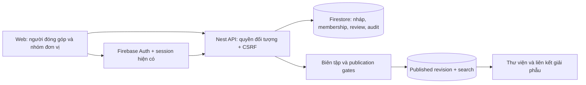

# Cộng tác y khoa — thiết kế sản phẩm và hệ thống

Ngày: 2026-10-01. Trạng thái: **ĐỀ XUẤT CHỜ DUYỆT TRIỂN KHAI**. Đây là thiết kế, chưa phải tính năng đã phát hành.

## 1. Mục tiêu

Tạo một nơi bác sĩ, bệnh viện và sinh viên cùng xây dựng kho kiến thức có nguồn, được phản biện, có thể cập nhật và dùng lại trong bài học/mô hình giải phẫu. Đơn vị giá trị là một đóng góp giúp người học hiểu đúng hơn hoặc sửa được sai sót cụ thể. Không dùng số bài đăng hay lượt thích để suy ra chất lượng y khoa.

Luồng điển hình: sinh viên thấy một thuật ngữ trên mô hình chưa rõ → đề xuất cách giải thích và nguồn → bác sĩ phù hợp chuyên môn phản biện → tác giả sửa → người có quyền xuất bản đưa phiên bản đã duyệt vào thư viện → đóng góp được ghi nhận trong hồ sơ của tác giả và liên kết tới cấu trúc giải phẫu.

## 2. Hiện trạng đã kiểm chứng

- `apps/api/src/editor.ts`: AUTHOR tạo article/revision; chính tác giả gửi DRAFT sang IN_REVIEW; REVIEWER không trùng authorId và phải khớp contentHash; PUBLISHER xuất bản sau assertPublishable; có withdraw và audit.
- `apps/api/src/publication.ts`: kiểm nội dung, hash, hạn review và phản biện không trùng tác giả. Chưa xác minh chuyên môn hay xung đột lợi ích trong hàm này.
- `apps/api/src/domain.ts`: quyền toàn cục USER/AUTHOR/REVIEWER/PUBLISHER/ADMIN; chưa có tổ chức, membership, hồ sơ xác minh, coauthor hay review assignment trong domain này.
- `packages/contracts/src/index.ts`: ArticleBody có nguồn tham khảo; metadata này chưa thay thế quyền sử dụng tài liệu hoặc kiểm chứng từng nhận định.
- Backend thực tế dùng Firebase Auth + API Nest + Firestore. Tài liệu governance cũ còn đoạn PostgreSQL: không lấy đoạn đó làm kiến trúc đang chạy.
- Repository Intelligence DEGRADED: index stale; CodeGraph tìm được EditorController và app registration, nhưng không nhận ra kiểm thử. Kết luận được kiểm tra lại từ source, không suy ra “không có test”.

## 3. Vai trò và giá trị

| Người dùng | Đóng góp | Lợi ích trực tiếp | Giới hạn quyền |
| --- | --- | --- | --- |
| Sinh viên | Đề xuất sửa sai, thuật ngữ Việt–Anh, tóm tắt có nguồn, câu hỏi học tập | Nhận phản hồi chuyên môn, lịch sử đóng góp có thể chia sẻ | Không tự duyệt/xuất bản; không gắn nhãn bác sĩ |
| Bác sĩ/giảng viên | Giải thích chuyên sâu, rà soát nội dung, thiết kế bài học | Ghi nhận tác giả/phản biện, bộ tài liệu giảng dạy | Chuyên môn được xác minh không đồng nghĩa mọi bài đã đúng |
| Bệnh viện/khoa/trường | Nhóm tác giả, bộ sưu tập, nhiệm vụ đóng góp | Kho học liệu có quản trị và ghi nhận đơn vị | Quản trị thành viên không tự cấp quyền phản biện/xuất bản |
| Biên tập viên | Tiếp nhận, kiểm nguồn/quyền dùng, phân công | Hàng đợi rõ trách nhiệm và phần cần sửa | Không sửa lén bản đã được phản biện |
| Người học/khách | Đọc nội dung đã xuất bản, báo lỗi có căn cứ | Thấy tác giả, người duyệt, nguồn, ngày cập nhật | Không xem nháp, hồ sơ xác minh hoặc thảo luận riêng |

Danh xưng tự khai, danh tính đã xác minh, chuyên môn đã xác minh, đại diện tổ chức đã xác minh, nội dung đã phản biện là các trạng thái khác nhau. Google login chỉ xác thực tài khoản đăng nhập; email bệnh viện hay ORCID không tự chứng minh giấy phép hành nghề.

## 4. UX đề xuất

Một mục điều hướng “Cộng tác” dẫn tới `/cong-tac`:

1. **Khám phá đóng góp**: nội dung đã xuất bản; lọc theo hệ cơ quan, chủ đề, loại học liệu, ngôn ngữ, tác giả/đơn vị. Hiển thị nguồn và lần kiểm duyệt; không xếp độ tin cậy theo độ nổi tiếng.
2. **Đóng góp của tôi**: nháp, đã gửi, cần bổ sung, đang phản biện, được duyệt, đã xuất bản. Mỗi thẻ có bước tiếp theo cụ thể.
3. **Tạo đóng góp**: chọn loại và mục tiêu học → nội dung và nguồn → đối chiếu bản xem trước → gửi. Nhập văn bản có cấu trúc, không chạy HTML/MDX tùy ý. MVP lưu thủ công và hiển thị trạng thái lưu thật.
4. **Phản biện**: so sánh phiên bản, nhận xét theo đoạn/nhận định, kiểm chứng nguồn, khai báo xung đột, yêu cầu sửa hoặc chấp nhận phiên bản cụ thể.
5. **Không gian đơn vị**: thành viên, người quản trị, danh sách học liệu, ghi nhận đóng góp. Trang công khai chỉ có nội dung được cho phép xuất bản dưới tên đơn vị.
6. **Hồ sơ đóng góp**: tên hiển thị tùy chọn, vai trò đã xác minh theo phạm vi, các nội dung đã xuất bản và đóng góp đồng tác giả. Không công khai email, bằng cấp scan hay giấy tờ xác minh.

Từ bài viết/cấu trúc giải phẫu có “Đề xuất chỉnh sửa”: mang theo target ID + published revision, tránh bắt người dùng nhập lại bối cảnh. Thông tin trên 3D chỉ thay đổi sau publication; gửi đề xuất không sửa trực tiếp mô hình.

Trạng thái cần kiểm thử: chưa đăng nhập; chưa có đóng góp; đang lưu; mất mạng; xung đột phiên bản; bị thu hồi membership; cần sửa với lý do; nguồn không truy cập được; nội dung bị rút; thiếu reviewer. Giữ nội dung nhập trong bộ nhớ khi lưu lỗi; không hứa lưu offline. Nút gửi không hiện thành công trước transaction. Không yêu cầu người dùng phải đóng góp để tiếp tục học.

## 5. Phạm vi MVP đề nghị duyệt

- Google login hiện có; mọi tài khoản được gửi đề xuất văn bản có giới hạn, không được tự nâng quyền AUTHOR.
- Ba loại đầu tiên: sửa nội dung hiện có, thẻ kiến thức có nguồn, thuật ngữ Việt–Anh. Đề xuất câu hỏi có nguồn được lưu nháp; xuất bản ngân hàng câu hỏi là bước riêng sau khi có kiểm định item.
- Hồ sơ tác giả và yêu cầu xác minh chuyên môn tối thiểu; xét duyệt thủ công bởi người vận hành được chỉ định. Không thu/upload giấy tờ định danh trong MVP; chỉ thông tin nghề nghiệp công khai và cách xác minh, không suy diễn khi chưa đủ bằng chứng.
- Một không gian đơn vị với mời/tháo thành viên, phạm vi riêng theo org; xác minh người đại diện trước khi dùng tên/logo công khai.
- Hàng đợi tiếp nhận, phân công reviewer, yêu cầu sửa, duyệt, xuất bản, rút nội dung và báo sai sót.
- Ghi công tác giả/đồng tác giả/người duyệt theo phiên bản; liên kết bài đã duyệt vào library và anatomy IDs có thật.

Chưa nhận bệnh án thật, DICOM, ảnh bệnh nhân, mô hình 3D upload hay ZIP trong MVP. Ca lâm sàng đầu tiên nếu thêm sau phải là ca mô phỏng ghi rõ nguồn/giả định. Không có feed chat trực tiếp, tư vấn bệnh nhân, thanh toán chia doanh thu, quảng cáo trong trình soạn thảo hoặc AI tự duyệt. Những phần này có chi phí và rủi ro khác với văn bản học thuật.

## 6. Quy trình và bất biến

`Nháp → Đã gửi → Kiểm tra đầu vào → Đang phản biện → Cần sửa / Được duyệt → Đã xuất bản`.

Được phép rút lại đề xuất trước publication; từ chối kèm lý do và đường gửi lại/đề nghị xem xét. Bản đã xuất bản sửa bằng revision mới; không ghi đè nội dung cũ. Rút nội dung giữ trang thông báo lý do phù hợp, không tiếp tục phục vụ nội dung bị rút qua cache/API.

- Mỗi lần gửi khóa snapshot có hash, tác giả/đồng tác giả, nguồn, khai báo lợi ích và quyền sử dụng. Sửa bất cứ phần thuộc phạm vi duyệt tạo hash/revision mới, vô hiệu chấp thuận cũ.
- Reviewer cần chuyên môn phù hợp, assignment đang hiệu lực, không là tác giả/đồng tác giả và khai báo xung đột. Cùng đơn vị không mặc nhiên độc lập; biên tập viên phải đánh giá và chỉ định người khác khi cần.
- Một reviewer đủ điều kiện cho học liệu nền tảng là đề xuất MVP. Nội dung ảnh hưởng quyết định điều trị cần chính sách riêng và chưa được mở trong MVP.
- Publisher kiểm lại quyền, assignment, trạng thái xác minh, hash, hạn review, quyền dùng nội dung và phiên bản public hiện tại trong cùng transaction.
- Review có thời hạn được người chịu trách nhiệm chuyên môn chọn; không đánh đồng review deadline với lịch ôn của người học.
- Số lượt thích không cấp quyền hay thay thế review. Tài trợ/quan hệ thương mại không bảo đảm xuất bản.

Thiết kế tham khảo nguyên tắc phản biện độc lập, quyền phản hồi và khai báo lợi ích trong [ICMJE responsibilities](https://icmje.org/recommendations/browse/roles-and-responsibilities/responsibilities-in-the-submission-and-peer-peview-process.html) và [COPE reviewer guidelines](https://doi.org/10.24318/2019.1.4). Đây là nguyên tắc thiết kế, không phải tuyên bố HumanScope được các tổ chức này chứng nhận.

## 7. Kiến trúc Firebase

Giữ deployment và Firestore hiện có. Không thêm graph DB, VM, Cloud SQL, paid search hay dịch vụ AI. Client không đọc/ghi trực tiếp draft Firestore. Phân trang bằng cursor, tải thủ công/thao tác người dùng; không listener thời gian thực cho toàn bộ diễn đàn. Chỉ lập chỉ mục public sau publication; nội dung riêng không gửi ads/analytics.

## 8. Dữ liệu và quyền sở hữu đề xuất

| Entity | Trường chính / quy tắc |
| --- | --- |
| ContributorProfile | userId, displayName, selfDeclaredRole, publicBiography, visibility; quyền hệ thống không lấy từ selfDeclaredRole |
| CredentialVerification | userId, scope, status, checkedBy, checkedAt, expiresAt, evidenceReferenceRestricted; không public evidence |
| Organization | id, verifiedName, publicSlug, representativeVerificationStatus; tạo org không đồng nghĩa được xác minh |
| Membership | orgId, userId, role, status, revision; role editor của org không tương đương global REVIEWER |
| Contribution | id, ownerId, orgId nullable, kind, targetType/Id, basePublishedRevisionId, latestRevisionId, state |
| ContributionRevision | immutable id, authorIds, body, sourceClaims, rightsDeclaration, conflicts, contentHash, createdAt |
| ReviewAssignment | revisionId, reviewerId, specialtyScope, state, conflictDeclaration, assignedBy |
| ReviewDecision | assignmentId, revisionId, contentHash, decision, reason, reviewDueAt; không tự chấp thuận |
| PublicationLink | contributionRevisionId → articleRevisionId/approved target; idempotent và giữ attribution |
| CorrectionReport | target published revision, reason, sources, triageState; không tự rút bài chỉ theo số report |
| ContributionAudit | actor/action/target/time/requestId, không body bài/giấy tờ trong log |

Thiết kế license: tác giả giữ quyền sở hữu; cần thỏa thuận rõ phạm vi cho nền tảng lưu, biên tập, công khai và sử dụng thương mại nếu có. Không tự mặc định CC license hoặc quyền cấp phép lại. Lưu phiên bản điều khoản được chấp thuận. Nguồn được trích dẫn không tự cho phép sao chép toàn văn/ảnh. TODO(owner): chọn chính sách quyền sử dụng với người phụ trách pháp lý trước publication cộng đồng.

## 9. API dự kiến và concurrency

Tất cả tên dưới đây là spec mới, chưa tồn tại:

- `POST /api/v1/contributions`, `GET /api/v1/me/contributions?cursor=…`.
- `GET /api/v1/contributions/:id`: chủ sở hữu, đồng tác giả đã chấp nhận, thành viên có scope hoặc reviewer được giao; không đoán được tài nguyên riêng qua lỗi.
- `POST /api/v1/contributions/:id/revisions`, `POST …/submit`, `POST …/withdraw-submission`.
- `GET /api/v1/reviewer/assignments`, `POST /api/v1/review-assignments/:id/decisions`.
- `POST /api/v1/editor/contributions/:id/assign`, `POST …/publish`.
- `POST /api/v1/organizations/:id/invitations`, `POST …/memberships/:userId/revoke`.
- `GET /api/v1/public/contributions?cursor=…`: projection chỉ public, không raw entity.

Mutation dùng session/CSRF, Idempotency-Key theo actor+action, If-Match theo revision; body không tự cấp ownerId/roles/verification. Publisher so basePublishedRevisionId với article pointer hiện tại: nếu article đã được cập nhật thì 409 và yêu cầu rebase/review, không ghi đè mất bài mới. Mỗi transaction đọc đủ quyền và version trước khi viết. Hai người duyệt/xuất bản đồng thời phải tạo đúng một kết quả, có audit; membership bị thu hồi có hiệu lực ở lần yêu cầu kế tiếp.

## 10. Bảo vệ nội dung và dữ liệu

Nguồn link được lưu/validate giao thức, không tự tải URL tùy ý trên server để tránh SSRF. Không nhúng HTML không kiểm soát. Giới hạn kích thước/số nguồn/tốc độ gửi; báo lạm dụng, khóa gửi tạm thời có lý do và đường xem xét lại. Chống spam bằng quotas, không dựa vào danh tiếng bác sĩ được tự khai.

Trong MVP, nhắc không đưa thông tin định danh bệnh nhân vào trường văn bản; bản nháp chỉ trong phạm vi có quyền; bộ lọc chỉ hỗ trợ phát hiện, không tuyên bố tự động ẩn danh chắc chắn. Người duyệt có bước kiểm tra dữ liệu nhạy cảm trước publication. [ICMJE privacy guidance](https://icmje.org/recommendations/browse/roles-and-responsibilities/protection-of-research-participants.html) nhấn mạnh bảo vệ quyền riêng tư và sự đồng ý khi công bố thông tin nhận diện; không được coi việc bỏ tên là đủ cho mọi trường hợp. Luồng dữ liệu bệnh nhân thật cần thiết kế riêng trước khi được mở.

TODO(owner): người chịu trách nhiệm nội dung, hỗ trợ khiếu nại, thời gian lưu hồ sơ xác minh/nháp/audit và quy trình quyền riêng tư. Thiết kế không tuyên bố tuân thủ pháp lý đã được xác nhận.

## 11. Ghi nhận giá trị và vận hành

Ghi công theo vai trò thực tế: tác giả, đồng tác giả, phản biện, chỉnh sửa, dịch thuật. Hồ sơ hiển thị đóng góp đã xuất bản, ngày cập nhật và liên kết phiên bản; không tự phát chứng chỉ đào tạo hoặc điểm CME.

Chỉ số pilot: số sửa sai được chấp nhận có lý do; tỷ lệ bài có nguồn và reviewer phù hợp; thời gian chờ phản biện; số bài quá hạn review; thời gian xử lý report; mức hữu ích do người học phản hồi. Báo cả mẫu số, thời gian, dữ liệu thiếu. Hiệu quả học tập cần đánh giá riêng, không suy từ pageviews.

Chi phí lớn có thể nằm ở chuyên gia phản biện và vận hành cộng đồng chứ không chỉ Firebase. Hàng đợi có sức chứa giới hạn theo reviewer; pilot mời nhóm nhỏ, không mở tăng trưởng không giới hạn trước khi có người xử lý. Không mua hay tạo tài nguyên trả phí trong giai đoạn thiết kế.

## 12. Lựa chọn, rủi ro và phát hành

Chọn đóng góp có cấu trúc + review thay cho diễn đàn tự xuất bản: ít nội dung tức thời hơn nhưng rõ nguồn và trách nhiệm. Reuse publication gates thay cho xây CMS thứ hai; bổ sung contribution intake để người dùng thường không nhận quyền editor toàn cục. Chưa dùng AI reviewer vì không giải quyết trách nhiệm chuyên môn.

Rủi ro chính: giả mạo bác sĩ/đơn vị (high, verification và revocation), bệnh nhân bị nhận diện (high, không intake file thật trong MVP), sai quyền tổ chức (high, policy tests), reviewer quá tải (high, pilot cap), xuất bản ghi đè (high, base version CAS), bản quyền (high, rights gate), điểm uy tín bị thao túng (medium, không quyền từ votes), chi phí đọc/dữ liệu tăng (medium, pagination/quotas).

Rollout: feature flag intake tắt mặc định → emulator/QA → pilot có người duyệt được phân công → mới mở public intake. Membership/verification có thể tạo thủ công qua admin được kiểm soát ở pilot; không seed bác sĩ đã xác minh giả. Rollback tắt gửi mới và publication cộng đồng, giữ bài đã xuất bản hợp lệ theo policy; không xóa nháp/review hay ghi công. Migration additive, không backfill quyền tự động. Chưa có lịch hứa ra mắt vì reviewer và điều khoản chưa được chốt.

## 13. Nghiệm thu

- Student/doctor tự khai đều gửi được nháp nhưng không tự publish.
- Đăng ký bệnh viện không tự cấp quyền đại diện hay đọc tài liệu riêng của tổ chức khác.
- Tác giả/đồng tác giả không tự review, reviewer chưa phù hợp/thu hồi assignment không được chấp thuận.
- Sửa nguồn/body/coauthors/rights làm review cũ không còn hiệu lực.
- Hai lượt submit/publish đồng thời, retry sau timeout, stale If-Match không mất nội dung hoặc nhân đôi publication.
- Bài DRAFT/WITHDRAWN/expired không xuất hiện trong public APIs, search, share, direct URL hoặc CDN cache.
- Trạng thái quyền/nguồn/kiểm duyệt rõ trên mobile/desktop, bàn phím, screen reader; không chỉ dùng icon/màu.
- Một đóng góp đi trọn luồng từ người học → reviewer khác người → xuất bản → hiển thị nguồn và attribution → đề xuất sửa/rút.

Các kiểm thử trên là tiêu chí cần thực hiện, chưa phải kết quả đã qua.
