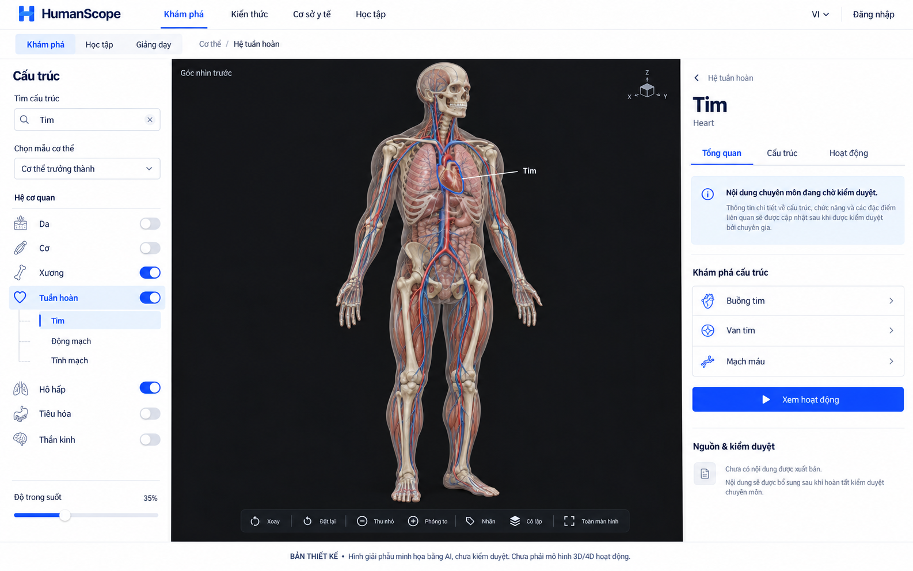
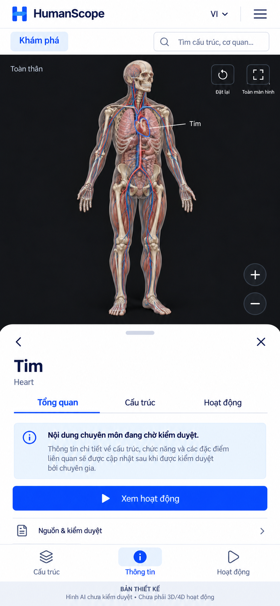
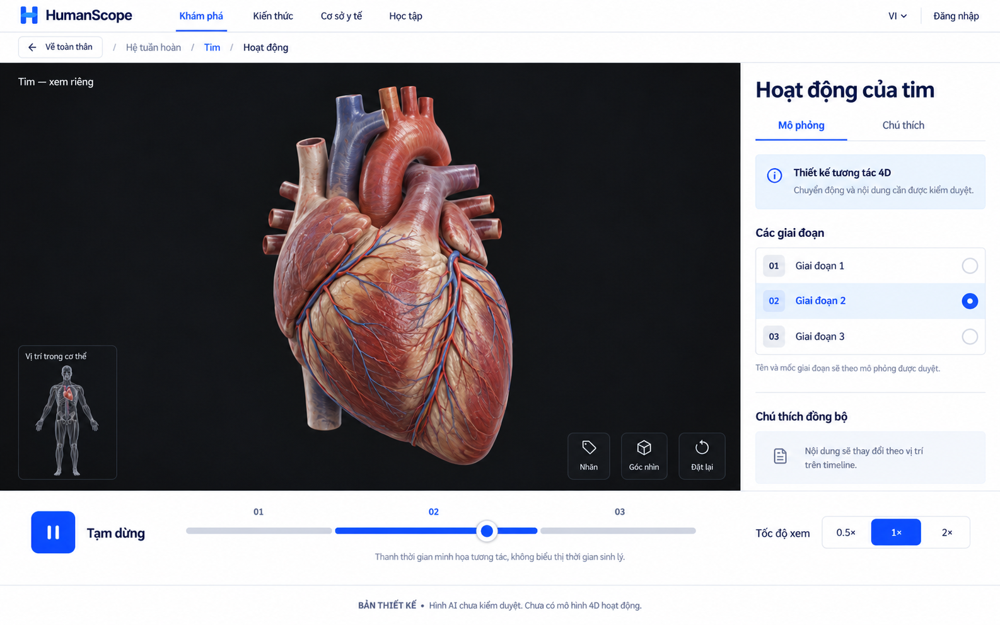

# HumanScope — UI/UX & thiết kế mô hình người 4D

Ngày: 30/09/2026 · Trạng thái: **VISUAL CONCEPT FOR REVIEW**. Nền tảng giữ Google Cloud + Firebase theo spec 0.2.

[Mở trang xem thiết kế](index.html) · [Đặc tả tương tác](ux-interactions.md) · [Thiết kế mô hình người 4D](human-4d-model-brief.md) · [Rà soát và giới hạn](review.md)

## Bộ màn hình

### 01 — Desktop

Canvas toàn thân là trọng tâm. Cây bên trái dùng chung lựa chọn với model và panel bên phải. Hình ở đây không có mesh/raycast/lớp hoạt động.

### 02 — Mobile

Canvas trước, sheet mở theo nhu cầu. Kích thước touch/sheet thực thi lấy từ đặc tả tương tác, không suy trực tiếp từ raster cao này.

### 03 — Hoạt động 4D

Tập trung tim, giai đoạn và timeline. Ba nhãn giai đoạn chỉ mô tả bố cục UI, không xác định số pha sinh lý hay thời gian thực.

## Đã có và chưa có

| Đã có trong bộ này | Chưa có |
| --- | --- |
| Ba ảnh UI độ chi tiết cao được tạo bằng Image Gen | File GLB/glTF/Blender, topology và model đã duyệt |
| Trang gallery chuyển màn hình và mở ảnh gốc | Chọn mesh, xoay model hoặc điều khiển lớp thật |
| Hợp đồng luồng/state/responsive/accessibility | Mô phỏng tim/hô hấp đã thẩm định và đồng bộ timeline |
| Brief dựng model, rig, mapping, animation và license gate | Dữ liệu y khoa xuất bản, kiểm thử device/GPU, production |

Các ảnh được tạo bằng công cụ `image_gen` tích hợp. Prompt nguyên văn được lưu ở [prompts.json](prompts.json). Mọi hình giải phẫu do AI tạo chỉ dùng trao đổi mỹ thuật/giao diện, không dùng làm nguồn dựng giải phẫu chính xác. Chưa có bản concept nào được owner đánh dấu accepted; không gán nhãn production design đã duyệt.
