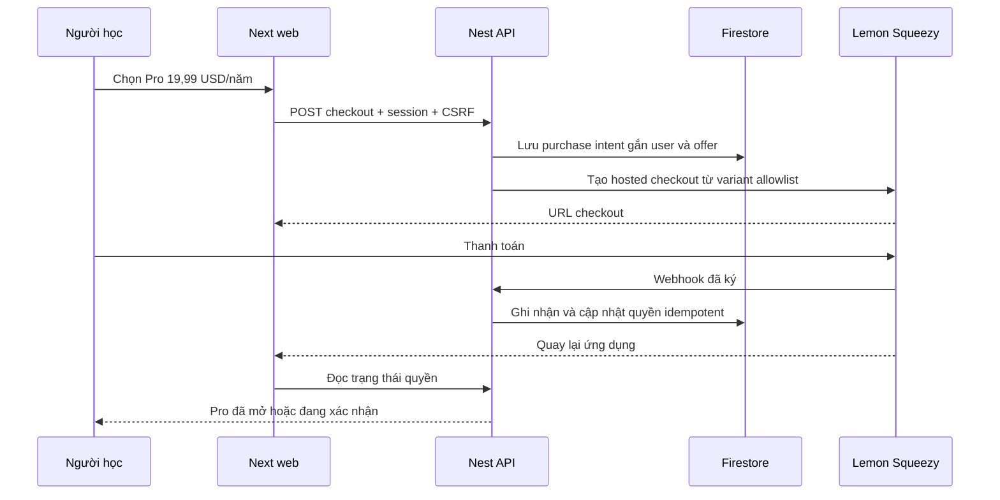

# HS-SUB-1 v2 — Free hấp dẫn, Pro đáng mua, thanh toán Lemon Squeezy

Ngày nghiên cứu: 2026-10-01 UTC / 2026-09-30 America/Chicago.
Trạng thái: **PROPOSED — chờ duyệt triển khai; chưa tích hợp hoặc kích hoạt thanh toán.**
Phạm vi phiên này: nghiên cứu sản phẩm, nguồn chính thức, kiểm tra source và lập kế hoạch. Owner đã chọn **Pro 19,99 USD/năm, chỉ gói năm** trong phiên này. Giá chưa được cấu hình lên provider; quota và thứ tự xây vẫn là đề xuất. Quyết định giá không tự thay cho duyệt phạm vi implementation.

## 1. Quyết định khuyến nghị

Ra mắt hai gói **Free / Pro cá nhân**. Free giúp người dùng khám phá và hoàn thành một vòng học có ích. Pro giúp học sâu, ôn đúng phần còn yếu và tổ chức kiến thức theo mục tiêu. Ưu tiên người học y, điều dưỡng và các ngành sức khỏe dùng tiếng Việt; đây là giả thuyết phân khúc cần phỏng vấn, không phải audience đã đo.

Giữ khám phá cơ bản miễn phí, không giới hạn số lần xoay/zoom hoặc buộc trả tiền để đọc nguồn và cảnh báo. Bán công cụ và nội dung học bổ sung đã được duyệt. Tính chính xác, quyền riêng tư, khả năng tiếp cận và an toàn là chuẩn chung của cả hai gói.

Chọn Lemon Squeezy làm bên xử lý thanh toán và vòng đời subscription; backend HumanScope quyết định quyền sử dụng. Chưa cần gói Team, AI trả phí theo lượt, license lifetime hoặc ứng dụng mobile.

## 2. Bằng chứng repository và giới hạn

- Commit nền `8a749e7881f8808473a7fc88a51ff81154aadd50`; phần lớn ứng dụng là WIP chưa tracked, README đang sửa. Commit không định danh toàn bộ candidate; không gộp kết quả test cũ thành bằng chứng phiên này.
- Gate ban đầu: hai index stale. Đã refresh một lần. Gate sau refresh: CodeGraph current/healthy, CocoIndex stale/health failed → **DEGRADED**. CodeGraph query `LearningController`, `PrivateController` và impact `SessionGuard` khớp source. Semantic evidence dùng đọc file có giới hạn; không tuyên bố phân tích toàn repo đầy đủ.
- Stack hiện hành: TypeScript, Next/React, NestJS, Firebase Auth, Firestore, Firebase Functions gen2, Firebase App Hosting; package manager pnpm, Vitest/ESLint/tsc. Manifest cho phép Node >=22.12 <26, Functions dùng Node24 theo báo cáo repo. Không dùng lại phương án Prisma/PostgreSQL cũ.
- `apps/api/src/identity.ts`: Firebase session cookie → SessionGuard → internal user UUID; có CSRF và session revocation. Không xây hệ đăng nhập thứ hai.
- `apps/api/src/private.ts`: notes, lessons, scenes theo owner, revision/idempotency. Đây là nền tảng, không chứng minh UI giảng dạy hoàn chỉnh.
- `apps/api/src/learning.ts`: quiz đã xuất bản, chấm bài idempotent, progress trả tối đa 100 attempts; chưa có spaced repetition hay lộ trình cá nhân. Không lấy 100 bản ghi gần nhất làm toàn bộ lịch sử.
- `apps/api/src/domain.ts`, `config.ts`, `app.ts` chưa có billing collections/module/config. Tìm `billing|subscription|entitlement|lemon` trong API/web/contracts/tests không có kết quả ở lúc kiểm tra.
- `apps/web/src/lib/ads-policy.ts::eligibleAdPath` loại mọi request có session khỏi quảng cáo. **Không quảng cáo không phải lợi thế độc quyền Pro hiện tại.** Giữ nguyên, không tăng quảng cáo Free để ép nâng cấp.
- `apps/web/src/app/hoc-tap/sinh-ly-benh/page.tsx` và asset route dùng `canPreviewScenario`, chỉ cho development. Preview chưa phải thư viện nội dung bán được.
- `docs/implementation/status.md` báo nền tảng đã live nhưng sản phẩm đầy đủ NOT_READY; đây là báo cáo cũ trong repo, không phải live verification phiên này. Asset, review y khoa, auth thật, restore và một số luồng sản phẩm vẫn là điều kiện cần kiểm chứng.
- `docs/implementation/cost-and-monetization.md` có đề xuất license một lần trên kiến trúc cũ. HS-SUB-1 đề xuất hướng subscription mới theo yêu cầu hiện tại, không tái sử dụng ngân sách SQL160USD làm chi phí Firebase.

## 3. Tham chiếu thị trường và cách khác biệt

Visible Body công bố Student Subscription **34,99 USD/năm**, có web/mobile; Professional **199 USD/năm** [S1]. Đây là mốc cạnh tranh, không phải bằng chứng người Việt sẵn sàng trả cùng mức giá.

BioDigital có Free với giới hạn sử dụng/lưu mô hình [S2]. Thông báo tháng 5/2026 cho biết họ ngừng các gói Personal Plus cá nhân và thu hẹp Free về Anatomy & Physiology [S3]. Không dùng các bảng giá Personal Plus cũ làm benchmark đang bán.

Lợi thế cần kiểm chứng của HumanScope: **học bằng tiếng Việt, đối chiếu thuật ngữ tiếng Anh, hiểu cơ chế qua thao tác và biết phần nào cần ôn**. Không cạnh tranh bằng lời hứa “nhiều mô hình nhất”. Không gọi vài animation là mô phỏng lâm sàng chính xác hay dự báo bệnh cá nhân.

## 4. Ma trận gói đề xuất

| Nhu cầu | Free | Pro cá nhân | Mức sẵn có hiện tại |
| --- | --- | --- | --- |
| Khám phá, tìm kiếm, nhãn, bài public, nguồn | Mở đầy đủ phần public đủ điều kiện; không quota lượt xem nhân tạo | Như Free | Viewer/public foundations; phụ thuộc asset và xuất bản |
| Học một chủ đề từ đầu đến cuối | Một module nền tảng hoàn chỉnh: giải thích → tương tác → quiz → phản hồi; làm lại không mất lượt | Thêm các module chuyên sâu đã duyệt | Quiz foundation có; bộ module chưa nghiệm thu |
| Sinh lý bệnh tương tác | Một bài mẫu trọn vẹn, được duyệt | Bộ chủ đề, mốc thời gian, đối chiếu trạng thái, giải thích cơ chế | Preview development, chưa bán |
| Tự ôn | Quiz public, phản hồi và lịch sử cá nhân cơ bản | Hàng đợi ôn câu sai, lịch ôn cách quãng, quiz theo phần còn yếu | Attempts có; engine ôn cần xây |
| Ghi chú và bộ học | Đề xuất 30 ghi chú, 3 bộ học, 10 cảnh/bộ | Đề xuất 1.000 ghi chú, 100 bộ học, 100 cảnh/bộ | APIs có; quota và UX cần xây |
| Tiến độ | Xem kết quả đã lưu của mình | Tiến độ theo chủ đề, lịch ôn, mục tiêu học | Basic API có; dashboard/lộ trình cần xây |
| Quảng cáo | Giữ policy hiện tại; người đăng nhập không nhận ads | Không quảng cáo | Không coi là USP Pro |
| Dữ liệu khi hết Pro | Đọc/xuất/xóa dữ liệu cá nhân, giữ lịch sử | Có thể tiếp tục bổ sung trong quota | Export/pagination cần hoàn thiện |

Quota là giới hạn lưu trữ đề xuất, cần đo trước khi chốt. Không hồi tố xóa hoặc khóa đọc dữ liệu hiện có vượt quota; tạm dừng tạo mới, cho giảm số lượng hoặc nâng cấp. Export chỉ gồm dữ liệu người dùng, không mặc nhiên xuất model, asset hoặc bộ câu hỏi có bản quyền. Giá trị đọc dữ liệu cá nhân không đồng nghĩa tiếp tục chạy nội dung Pro đã hết quyền.

Không đổi quiz public đang có thành paid. Phân loại explicit các module Pro mới; mặc định dữ liệu cũ vẫn public theo điều kiện xuất bản hiện hành. Paid không vượt publication/review/license guards và không cấp role AUTHOR/REVIEWER/PUBLISHER.

### Trải nghiệm tạo lý do quay lại

Buổi đầu: vào thẳng mô hình đủ điều kiện → chọn một chủ đề → tương tác → hoàn thành quiz → xem giải thích → đăng nhập khi muốn lưu. Chỉ gợi ý Pro khi người dùng muốn mở module chuyên sâu hoặc sử dụng hàng đợi ôn tập. Không cắt ngang bài đang học.

Điểm nổi bật Pro: chọn mốc diễn biến để thấy cấu trúc/chức năng thay đổi; trả lời câu hỏi liên quan; lần sau được đưa về đúng phần từng trả lời sai. Có thể bắt đầu bằng quy tắc ôn tập xác định, chưa cần gọi AI. Nếu thêm AI phải có plan riêng cho nguồn, kiểm chứng, chi phí và phạm vi giáo dục.

Free demo trọn một module là cách thử trước mua của V1. Chưa triển khai trial tự gia hạn bằng thẻ; giảm số trạng thái thanh toán và tránh bất ngờ cho người học.

## 5. Giá và kinh tế đơn vị

Giá theo quyết định owner: **19,99 USD/năm**, chỉ một gói Pro theo năm, không có gói tháng. Thu 19,99 USD mỗi năm; tương đương khoảng 1,67 USD/tháng chỉ là số quy đổi, không phải lựa chọn thanh toán tháng. Phải thể hiện tổng thu, chu kỳ tự gia hạn và thuế trước checkout. Chưa chốt VND, tỷ giá hoặc khẳng định khách thanh toán bằng phương thức địa phương nào.

Lemon công bố phí cơ bản **5% + 0,50 USD/giao dịch**, thêm **0,5% subscription**, **1,5% giao dịch quốc tế**, **1,5% PayPal** khi áp dụng; payout có thể có phí riêng. Phí được tính trên tổng đơn bao gồm thuế [S4–S5].

Ví dụ giả định thẻ quốc tế, không có thuế, PayPal, refund hoặc payout fee: phí = `P × 7% + 0,50`; còn lại năm ≈ **18,09 USD** (≈1,51 USD/tháng dịch vụ). Đây chỉ là doanh thu sau phí nền tảng giả định, chưa phải lợi nhuận. Với thuế cộng ngoài tỷ lệ t, tính `net = P - (P × (1+t) × 7% + 0,50)` trước các chi phí khác. Tax-inclusive pricing phải tính lại từ phần doanh thu chưa thuế.

Công thức kiểm tra khả năng sống: `paid_count × contribution_per_paid >= fixed_cost + free_users × variable_cost_per_free`. Contribution phải trừ asset/license, review nội dung, support, bandwidth, refund và phí payout phù hợp. Chưa có hóa đơn Firebase/cost per session/WTP nên không công bố số khách hòa vốn như dự báo.

Gói năm cần giữ ngân sách cho đủ 12 tháng phục vụ, không coi toàn bộ cash nhận trước là lợi nhuận tháng đầu. Với mức 19,99 USD/năm, ưu tiên nội dung biên soạn sẵn, asset được cache đúng quyền và lịch ôn theo quy tắc; không bao gồm AI trả phí không giới hạn. Cần đo chi phí cả người dùng Free lẫn Pro; mức giá owner chọn vẫn cần pilot để kiểm chứng nhu cầu và biên đóng góp. Không lifetime, auto-overage hoặc mua AI không giới hạn.

## 6. Kiến trúc tích hợp

Provider là nguồn trạng thái billing; entitlement projection server là nguồn quyền trong app. Redirect, query string hoặc localStorage không chứng minh trả tiền. Portal giúp tự quản lý subscription, vẫn cần webhook để đồng bộ [S6–S8].

### API và dữ liệu mới, thêm vào hệ thống hiện tại

- `GET /api/v1/billing/offers`: catalog hiển thị đã đối chiếu cấu hình provider; chỉ offer launch-ready. Internal code `pro_yearly_v1`; IDs Test/Live allowlist riêng.
- `POST /api/v1/billing/checkout`: SessionGuard + CsrfGuard; nhận offer code và idempotency key. Server tự chọn user, store, variant, quantity=1 và return URL. Không nhận giá/customerId tùy ý từ client. Purchase intent opaque gửi qua custom data; resolve user từ intent đã lưu, không bind chỉ bằng email.
- Chống double-click và hai tab bằng transaction/lease trên intent. Khi provider create timeout không rõ kết quả, giữ trạng thái uncertain và đối soát, không retry POST mù hoặc giả định provider có idempotency header. Nếu đã có subscription/pending intent thì dẫn tới quản lý/khôi phục trước khi tạo mới. Dù vậy cần phát hiện double purchase ngoài app và quy trình support, không hứa ngăn tuyệt đối ở provider.
- `GET /api/v1/me/entitlements`: trả plan, features, quotas, status, validUntil, pending và thời điểm xác nhận; private/no-store. Không gộp plan thành security role.
- `POST /api/v1/billing/portal`: session + CSRF; resolve customer/subscription của chính user, lấy signed portal URL mới, không ghi URL vào logs; allowlist đích. Link có thời hạn theo provider [S8].
- `POST /api/v1/billing/webhooks/lemon`: không dùng user session/CSRF; xác thực HMAC-SHA256 trên raw bytes theo X-Signature. Validate encoding/length trước timingSafeEqual. Functions đã có `req.rawBody`; local Express phải capture trước parse. Giữ giới hạn body, không nới toàn hệ thống [S9].
- Collections dự kiến: `billingCustomers`, `checkoutIntents`, `subscriptions`, `billingEvents`, `entitlements`, `usageCounters`, `billingAudits`; namespace theo mode/store. Internal user UUID khác firebaseUid, không trộn hai ID. Không lưu card data, full payload PII hay URL bearer vào audit.
- Firestore transaction đọc trước ghi, cập nhật event/subscription/entitlement/counter nguyên tử. Provider call nằm ngoài retrying transaction; không gọi API ngoài trong callback transaction.
- Existing read/owner/CSRF guards giữ nguyên. Content Pro bị enforce ở API/asset delivery, không chỉ nút UI. Không bundle nội dung paid trong JS/public bucket rồi che bằng paywall. Link chia sẻ chỉ cấp phạm vi được phép; người nhận Free không tự được toàn quyền Pro của người gửi.

### Đồng bộ tin cậy và lỗi

Webhook không được giả định có unique delivery-event ID hoặc signed timestamp nếu contract không cung cấp. Dùng digest raw body + mode/store/event type làm receipt dedupe; resource ID trong `data.id` không phải delivery ID. Kiểm tra event name header/body, store, variant và mode. Không dùng thời gian nhận làm thứ tự trạng thái.

So `updated_at` resource để tránh ghi đè bằng event cũ; timestamp bằng nhau, payload xung đột, refund hoặc event khác resource phải retrieve trạng thái chính thức rồi reconcile. Tách invoice/payment ledger khỏi subscription snapshot. Replay event đã xử lý không được gia hạn thêm hoặc mở lại quyền đã thu hồi. Binding customer→user bất biến, trường hợp không tìm được intent đưa vào trạng thái xử lý thủ công, không gán ngẫu nhiên.

V1 xử lý inline trong thời gian hữu hạn; chỉ trả 200 khi đã commit hoặc đã persist công việc chờ xử lý bền vững. Provider retry hữu hạn [S10], nên cần reconciliation định kỳ theo batch có cursor, retry/backoff giới hạn và cảnh báo backlog; không dùng promise chạy ngầm sau khi Functions trả response. Schedule/retry storage/config là phần cần duyệt trước triển khai.

Lưu projection đủ để quyền đang hợp lệ hoạt động khi Lemon chập chờn; không gọi Lemon mỗi lần xoay model. Khi chưa xác nhận payment không mở mới Pro; khi đồng bộ lỗi không trình bày là khách chưa trả tiền. Sau checkout poll có giới hạn (đề xuất tối đa60s), rồi hiện pending và cho kiểm tra lại; chống double-submit.

| Trạng thái | Quyền đề xuất |
| --- | --- |
| Free/pending checkout | Free; pending không chứng minh thanh toán |
| active đã xác minh | Pro đến hạn đã xác nhận; retry reconcile trước hạn |
| cancelled | Pro tới `ends_at`, ngừng lần gia hạn sau; không khóa ngay |
| past_due | Grace đề xuất72h từ lần thất bại đầu tiên đã lưu, không reset do retry; sau đó Free |
| unpaid / expired | Free; giữ dữ liệu cá nhân |
| paused / on_trial | V1 không cung cấp; cảnh báo nếu gặp và reconcile; không tự suy ra paused là hết quyền vì pause có nhiều mode |
| full refund / dispute | Reconcile payment liên quan; thu hồi grant bị hoàn/đảo theo policy được duyệt, không xóa dữ liệu hoặc grant khác |
| partial refund | Ghi số tiền và đối soát; không mặc định thu hồi cả kỳ |

Cancellation/expiry/past_due semantics phải theo subscription object [S11]; `renews_at` trong past_due có thể là lần thử thu tiếp, không dùng làm bằng chứng đã trả thêm kỳ. Cần lưu paid-through/grace riêng, kiểm tra finite cutoff ở mỗi server request. Chính sách refund, dispute và pause chính thức phải được chốt trước Live; không bịa event `chargeback` khi provider chưa có contract tương ứng.

## 7. Kế hoạch triển khai theo file và nghiệm thu

**Risk HIGH:** tiền, phân quyền, dữ liệu và raw-body webhook. Chỉ bắt đầu protected edits sau duyệt HS-SUB-1.

| Đợt | Files / functions dự kiến | Điều kiện hoàn thành |
| --- | --- | --- |
| A — billing core TEST | Tạo `apps/api/src/billing.ts`, `entitlements.ts`, `lemon.ts`; thêm schemas `packages/contracts/src/billing.ts`, export từ `index.ts`; mở rộng `domain.ts::Collections`, `config.ts::readConfig`; đăng ký trong `app.ts::createApp`; raw-body trong `app.ts`/`firebase.ts` | Checkout, webhook, quyền, portal chạy với fixtures/emulator và Lemon TEST; test/live tách biệt |
| B — chính sách quyền | `private.ts::createNote/createLesson/addScene`, `learning.ts::list/quiz/attempt/progress/share/shared`; API content mới khi module đủ điều kiện; `public.ts`/`publication.ts` chỉ tại đường cung cấp nội dung paid mới | Free cũ giữ nguyên; quota atomic; owner/rbac không đổi; expired không mất dữ liệu; pagination/export an toàn |
| C — luồng mua | Tạo `apps/web/src/app/goi-dich-vu/page.tsx`, `tai-khoan/thanh-toan/page.tsx`, `thanh-toan/ket-qua/page.tsx`, `components/billing.tsx`; dùng `packages/api-client/src/index.ts`; điều hướng `components/header.tsx`/`explorer.tsx` nơi phù hợp | Đủ loading/pending/success/cancelled/failed/unavailable/past_due/expired; keyboard/mobile; không nhận thẻ trong app |
| D — giá trị Pro | Reuse `learning.ts` attempts; thêm `review-schedule.ts`, schemas, collections schedule và UI học tập; content packs có entitlement metadata riêng | Một module Free hoàn chỉnh; tối thiểu ba module chuyên sâu Pro được duyệt và có quyền sử dụng; hàng đợi ôn sai chạy thật; không mở preview bằng đổi NODE_ENV |
| E — vận hành và phát hành | `.env.example`, `infra/firebase/firestore.indexes.json`, Functions secret binding/scheduler, runbook; docs sản phẩm/data/API; regenerate `docs/implementation/openapi.json` từ source | Config mặc định checkout OFF, catalog match, monitor/reconcile, rollback; Live chỉ sau owner/provider approval và nghiệm thu riêng |

Đợt D phải có danh sách nội dung/asset được owner và reviewer xác nhận trước khi coding phạm vi cụ thể; bổ sung delta-plan cho từng module nếu vượt nền tảng hiện có. Ba module là ngưỡng đề xuất kiểm soát lời hứa giá trị, không phải bằng chứng đủ để khách mua. A–C có thể hoàn thành ở TEST trước, nhưng không mở bán chỉ vì nút mua đã chạy.

MVP riêng A–C giữ nhỏ: REST adapter server dùng fetch/timeout thay vì thêm framework billing hoặc auth; một product Pro, một recurring variant theo năm. Không cần bộ chọn tháng/năm hay đổi chu kỳ trong UI. Nếu bổ sung gói khác sau này phải có delta-plan, giá preview và kiểm thử invoice/proration. Teaching/Team, seats, commercial export, offline và LMS tách scope.

## 8. Kiểm chứng bắt buộc sau duyệt

- Unit mới `tests/billing.test.ts`, `entitlements.test.ts`: signatures sai/thiếu/length; server offer allowlist; trạng thái, cutoff, tax/currency minor units; partial/full refund mapping.
- Integration mới `tests/billing.integration.test.ts` và regression `tests/api.integration.test.ts`: hai user, IDOR, CSRF, direct API bypass, double-click/two tabs, expired intent, webhook-before-return, duplicate/out-of-order/equal timestamp, wrong store/variant/mode, transaction retry, quota concurrent writes, provider timeout, worker failure/reconcile, paid shared content leakage.
- `tests/firebase-wrapper.test.ts`: raw bytes preserved ở cả Functions và local; giới hạn body; signature không ký lại JSON. `tests/ads-policy.test.ts`: policy ads hiện có giữ nguyên.
- Browser ở mobile/desktop: Free → đăng nhập → TEST checkout → return pending → Pro → portal → cancel → giữ quyền hết kỳ → Free, payment failure/recovery; thao tác bàn phím, screen-reader status, back button, refresh, hết session và hai tab. Kiểm chứng no-network ads cho signed-in users.
- Commands theo manifest: `pnpm test`, `pnpm test:integration` với Auth/Firestore Emulator cấu hình đúng, `pnpm typecheck`, `pnpm lint`, `pnpm build`; không coi local/mock là live payment acceptance.
- Quality profiles: universal, typescript-javascript, api, database, web-app; bổ sung product-content, visual-design và infrastructure khi triển khai UI/config. Product Language Gate phải kiểm đủ tám nguyên tắc và trạng thái trong UI thực; bản plan này chưa thay string/UI nên chưa có in-context approval.
- Metrics đề xuất: hoàn thành module Free, quay lại tuần sau, bắt đầu/hoàn tất checkout, paid retention, refund, contribution sau phí, webhook lag/reconcile failures. Cohort theo tuần; denominators rõ, không đếm click thành học thành công. Không gửi bệnh/chủ đề nhạy cảm, notes, answers hoặc health query sang payment/marketing. Chưa thêm tracking bên thứ ba.
- Kiểm chứng mức giá owner chọn: phỏng vấn10–15 người học mục tiêu, cho dùng module hoàn chỉnh, xem tác vụ/lý do quay lại, kiểm chứng willingness-to-pay; nhóm này là nghiên cứu định tính, không chứng minh conversion thị trường. Pilot trả phí chỉ sau launch gates; theo dõi các cohort trước khi điều chỉnh giá/quota, không tạo urgency hoặc social proof giả.

## 9. Launch, quan sát và rollback

Lemon hỗ trợ payout tại Việt Nam theo danh sách công khai [S12], nhưng store vẫn cần xét duyệt/identity verification [S13]. Chưa xác minh merchant/account/store hiện có, product IDs hoặc Live approval. Test và Live dùng catalog/webhook/keys riêng [S14]. Không tái dùng IDs từ sản phẩm Satsunic khác.

Điều kiện mở bán: licensed assets, medical review, Free/Pro module nghiệm thu, giá/currency và renewal/refund terms, server authorization, TEST lifecycle đầy đủ, store được duyệt, provider config readback, smoke live trong phạm vi giao dịch owner cho phép. Không cần dựng staging trả phí chỉ để test; fixtures/emulator rồi TEST provider endpoint được cho phép.

Logs chỉ event digest, trạng thái và mã lỗi, không payload/secret/portal URL. Cảnh báo signature failures, unknown offers, pending quá hạn, reconcile backlog và entitlement mismatch; runbook khôi phục bằng re-fetch/replay idempotent. Không xóa event audit để làm chỉ số đẹp.

Rollback: tắt tạo checkout mới bằng flag, giữ webhook/portal/reconciliation và grant đã thanh toán hoạt động; deploy tương thích schema additive. Nếu module bị rút vì license/review, dừng cung cấp module dù user Pro và xử lý support/refund theo policy. Không rollback bằng cách cho mọi người Pro hoặc xóa subscription collections.

## 10. Review và báo cáo phạm vi phiên nghiên cứu

- Nghiên cứu/phân tầng/kế hoạch: hoàn thành bản đề xuất v2; owner đã chọn giá19,99USD/năm, còn chờ duyệt phạm vi implementation.
- Review tài liệu chu kỳ1: phát hiện ad-free không độc quyền, kiến trúc kinh tế cũ, preview chưa bán được, resource ID không phải webhook event ID. Đã phản ánh vào plan.
- Review tài liệu chu kỳ2: rà lại source và contract provider; thêm rawBody Functions/local, paid-through khác renews_at, uncertain checkout, quyền dữ liệu sau downgrade và tương thích Free hiện có. Không khẳng định đã test các hành vi được đề xuất.
- `final-implementation-review` đã đọc để xác định gate: **NOT_APPLICABLE cho implementation phiên này vì không sửa ứng dụng/config/tests; implementation review sau coding còn NOT_RUN**, không tuyên bố PASSED sản phẩm. Chỉ self-review tài liệu; chưa có independent runtime review receipt.
- Build/unit/integration/browser/live payment: **NOT_RUN trong phiên nghiên cứu**. Không thay ứng dụng nên không chạy lại suite hiện tại chỉ để tạo số PASS.
- Gate source discovery: DEGRADED như mục2; kiến trúc/API/security/ops được review ở mức thiết kế. Chưa xác minh runtime, không chứng nhận production-ready.
- Production payment readiness: **NOT_READY**. Còn duyệt plan, build Pro, cấu hình catalog theo giá đã chọn và chốt policy, xác minh store và kiểm thử lifecycle.
- Thay đổi task: thêm tài liệu này; giữ WIP khác, không commit/push/deploy hay gọi provider có thanh toán. Index refresh tạo local metadata.
- Token usage / actual billed cost: **Unavailable**. Memory candidates: **None**.

Bổ sung review v2: bỏ gói tháng và chiết khấu so với tháng; cập nhật một annual variant, phép tính phí và scope xin duyệt theo quyết định giá mới.

## 11. Nguồn chính thức đã đọc

- [S1 — Visible Body Suite và giá](https://www.visiblebody.com/anatomy-and-physiology-apps/vb-suite)
- [S2 — BioDigital plans](https://pricing.biodigital.com/)
- [S3 — BioDigital individual-plan changes May2026](https://support.biodigital.com/hc/en-us/articles/39657133675927-May-2026-Changes-to-Individual-Plans-and-Free-Trials)
- [S4 — Lemon pricing](https://www.lemonsqueezy.com/pricing)
- [S5 — Lemon fees và payout](https://docs.lemonsqueezy.com/help/getting-started/fees)
- [S6 — Create checkout](https://docs.lemonsqueezy.com/api/checkouts/create-checkout)
- [S7 — Webhook event types](https://docs.lemonsqueezy.com/help/webhooks/event-types)
- [S8 — Customer Portal](https://docs.lemonsqueezy.com/guides/developer-guide/customer-portal)
- [S9 — Signing requests](https://docs.lemonsqueezy.com/help/webhooks/signing-requests)
- [S10 — Webhook requests và retry](https://docs.lemonsqueezy.com/help/webhooks/webhook-requests)
- [S11 — Subscription object](https://docs.lemonsqueezy.com/api/subscriptions/the-subscription-object)
- [S12 — Supported countries](https://docs.lemonsqueezy.com/help/getting-started/supported-countries)
- [S13 — Activate your store](https://docs.lemonsqueezy.com/help/getting-started/activate-your-store)
- [S14 — Testing and going Live](https://docs.lemonsqueezy.com/guides/developer-guide/testing-going-live)

## Phạm vi xin duyệt

Duyệt HS-SUB-1 v2 để bắt đầu A–C: Free/Pro, giá19,99USD/năm đã chọn, chỉ gói năm, nền tảng billing và UI trong TEST, giữ dữ liệu/quyền Free hiện có. Đợt D cần danh mục nội dung và delta-plan cụ thể; Live/store activation/giao dịch thật chỉ thực hiện sau các điều kiện mục9. Skill `change-impact-plan` quy định: “Implementation must not begin until explicit developer approval is provided.”
