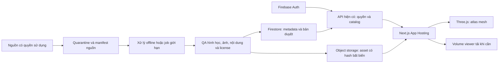

# HumanScope: nâng cấp giải phẫu, lát cắt và 4D có giá trị học y

Ngày kiểm tra nguồn: **01/10/2026**. Phạm vi: nghiên cứu, thiết kế và đề xuất triển khai. Chưa thay đổi ứng dụng, mua license, nhập dữ liệu bệnh nhân hoặc triển khai production trong đợt này.

## 1. Kết luận và quyết định đề xuất

Ưu tiên một atlas toàn thân đầy đủ hơn, một phòng xem lát cắt thật, rồi hai bộ dữ liệu chuyển động tim và hô hấp. Không cố làm tất cả cơ quan “đập” bằng animation chung. Giá trị học tập đến từ việc liên hệ đúng cấu trúc, mặt phẳng, ảnh nguồn, thời điểm và giải thích đã kiểm duyệt.

**Phát hiện đáng làm trước:** converter hiện dùng danh mục PART-OF với 1.258 mã hình học. Danh mục IS-A chính thức có 2.234 mã, bao gồm toàn bộ 1.258 mã đó và thêm **976 mã**. `FJ2428` — thành tâm thất — có trong IS-A nhưng không có trong danh mục đang dùng. Có thể bổ sung hình học bị thiếu từ cùng nhà cung cấp trước khi tìm model mới. Đây là kết quả so sánh danh mục, chưa phải xác nhận 976 mesh đã tải, đẹp, không trùng hoặc phù hợp y khoa. [Danh mục và download BodyParts3D](https://dbarchive.biosciencedbc.jp/en/bodyparts3d/download.html)

Ba gói nội dung đầu tiên đề xuất:

1. **Atlas + lát cắt ngực/bụng:** bổ sung hình học, chọn vùng, ba mặt phẳng trực giao, CT cùng phân đoạn; ảnh giải phẫu Visible Human ở chế độ so sánh mẫu riêng.
2. **Tim theo chu kỳ:** cine-MRI Sunnybrook; xem ảnh và pha thật trước, tái tạo bề mặt chuyển động sau khi xác minh phân đoạn và tương ứng thời gian.
3. **Phổi theo chu kỳ thở:** một ca TCIA 4D-LUNG được tuyển chọn; đồng bộ pha hô hấp, lát cắt và bề mặt nếu có phân đoạn phù hợp.

Các gói là đề xuất làm thử có điều kiện nghiệm thu. Không gọi chúng là sản phẩm đã được xác nhận dùng cho chẩn đoán hoặc lập kế hoạch điều trị. Chưa có người phụ trách kiểm duyệt y khoa của sản phẩm.

## 2. Hiện trạng đã đối chiếu trong repository

| Quan sát từ source | Hệ quả đối với nâng cấp |
|---|---|
| `scripts/free-anatomy/full-body-prepare.py` chọn FMA20394 từ PART-OF, có kiểm tra 1.258 mảnh | “Toàn thân” hiện chưa đồng nghĩa toàn bộ hình học có trong nguồn |
| Asset hiện tại có 44 GLB, tổng 65.930.408 byte; bản nguồn dùng mức giảm polygon 99% | Kiểm tra chất lượng từng cơ quan ở khoảng cách gần; không suy ra chất lượng từ số polygon |
| `packages/anatomy-viewer/src/full-body-canvas.tsx` dùng một `THREE.Plane` nằm ngang | Hiện là cắt bề mặt mesh; chưa có MPR/voxel hoặc mô cắt thật |
| `apps/web/src/lib/body-explorer.ts` liên kết FMA/FJ, tìm kiếm và điều hướng vùng | Tái sử dụng định danh; cần chọn kết quả chính xác trước nhóm tổ tiên rộng |
| Heart binding có FJ2428 nhưng danh mục PART-OF không chứa mã đó | Có đường bổ sung thành thất bằng IS-A cần kiểm tra tiếp |
| Hoạt động tim hiện là minh họa định tính theo timeline | Không phải dữ liệu co bóp tim đo theo thời gian |
| Contracts yêu cầu license, reviewer, hash và trạng thái reviewed | Mở rộng contract có phiên bản; không bỏ cổng duyệt để có nội dung nhanh |
| Asset route dưới `kham-pha/toan-than/asset/[layer]` chỉ phục vụ development | Không coi local xem được là bằng chứng production đã phân phối được asset mới |
| Thiết kế migration hiện dùng App Hosting, Auth, Firestore, Functions; truy cập dữ liệu qua API | Giữ hệ thống này; đưa blob lớn vào object storage, không vào Firestore |

Repository Intelligence: **DEGRADED**. CodeGraph truy vấn được nhưng index stale; CocoIndex stale và health check lỗi quyền truy cập daemon log. Đã thử refresh theo gate; kết luận trên dựa vào source đọc có giới hạn, manifest và kiểm tra danh mục, không phải audit toàn repository. Production chưa được thăm dò trong nghiên cứu này.

Bằng chứng cục bộ: `.ai/local/med4d-research-intelligence.json`, `.ai/local/med4d-research/coverage-comparison.json`, `.ai/local/med4d-research-dataset-metadata.json`. Bảng IS-A tải 1.142.159 byte, SHA-256 `a3de74423f943b0d724ae8f59b3a817f87c423a544f8db98113b1980817cbeaf`.

## 3. Phải phân biệt bốn loại trải nghiệm

| Loại | Dữ liệu cần | Có thể học được | Không được suy diễn |
|---|---|---|---|
| Cắt mô hình bề mặt | Mesh có topology đủ tốt, mặt phẳng cắt | Vị trí, tương quan, phần trước/sau mặt phẳng | Không tạo ra ảnh mô hay mật độ CT |
| Lát cắt ảnh thật / MPR | Volume với spacing, origin, direction, intensity đúng | Giải phẫu trên CT/MRI, chuyển mặt phẳng, đối chiếu mask | Không có chuyển động nếu chỉ có một thời điểm |
| Dữ liệu theo thời gian | Cine hoặc nhiều volume có pha/thời gian xác định | Quan sát thay đổi được ghi nhận ở ca nguồn | Không tự suy ra dòng máu, ECG hay áp lực |
| Mô phỏng / minh họa | Mô hình số hoặc animation có mô tả giả định | Hiểu cơ chế và tác động tham số | Không trình bày như đo từ người thật |

“4D” ở đây là cấu trúc/ảnh cộng trục thời gian hoặc pha được định nghĩa. Xoay camera, phóng to và thay opacity không tạo thêm chiều thời gian sinh lý. Cine 2D theo thời gian cũng phải ghi đúng là cine, không quảng bá thành volume 3D động nếu chưa tái tạo được.

## 4. Nguồn ưu tiên và điều kiện sử dụng

Thông tin dưới đây là kiểm tra trang nguồn và một số metadata công khai. Quyền của dữ liệu, mã nguồn, model AI, nội dung biên soạn và ảnh minh họa là các lớp riêng. Website dự kiến có quảng cáo/bán license nên không dùng nguồn NC chỉ vì truy cập miễn phí.

| Nguồn | Phù hợp | Quyền và bằng chứng | Điều kiện trước khi đưa lên web |
|---|---|---|---|
| **BodyParts3D** | Atlas toàn thân, bổ sung hình học IS-A | Trang chính thức hiện ghi CC BY 4.0; bản OBJ download được giảm polygon 99%. [License](https://dbarchive.biosciencedbc.jp/en/bodyparts3d/lic.html) | Lưu receipt phiên bản, giải quyết header license cũ, loại mesh chồng lấp, kiểm tra mỗi vùng |
| **NLM Visible Human** | Cryosection màu, CT/MRI toàn thân của hai mẫu | NLM ghi dữ liệu public domain, không còn yêu cầu license truy cập từ 2019. [Nguồn](https://www.nlm.nih.gov/research/visible/visible_human.html) | Kiểm tra spacing, hướng, căn chỉnh từng modality; không ghép như cùng người với BodyParts3D |
| **Sunnybrook Cardiac Data** | Cine-MRI tim, ưu tiên học thất trái | 45 ca; trang nguồn ghi CC0 1.0, có contours và LV models. [Nguồn](https://www.cardiacatlas.org/sunnybrook-cardiac-data/) | Xác minh link tải, pha nào có contour, số lát và khoảng cách; không hứa đầy đủ van/bốn buồng |
| **TCIA 4D-LUNG** | CT theo pha hô hấp | 20 người bệnh ung thư phổi; CT/RTSTRUCT; tổng 183,04 GB; CC BY 3.0. [Nguồn](https://www.cancerimagingarchive.net/collection/4d-lung/) | Chọn một ca, xác minh điều khoản và metadata; không gọi mẫu phổi khỏe mạnh; trang có lúc lỗi truy cập |
| **TotalSegmentator v2 dataset** | CT và mask nhiều cấu trúc cùng ca để học MPR | 1.228 CT, 117 cấu trúc, archive 23.586.975.073 byte; metadata Zenodo ghi CC BY 4.0. [Record](https://zenodo.org/records/8367088) | Đọc archive manifest trước khi tải trọn; kiểm tra mask, ca bệnh và ẩn danh; dữ liệu tĩnh |
| **HRA/HuBMAP** | Model từng cơ quan, liên kết cấu trúc–mô–tế bào | CCF 3D Reference Object Library được FAQ ghi CC BY 4.0. [FAQ](https://docs.hubmapconsortium.org/faq.html) | Chốt release/manifest thực có; các reference organ không mặc nhiên thuộc cùng một cơ thể |
| **Cardiac CT 15 sets** | Ứng viên CT tim nhiều pha | Figshare mô tả 21 pha/ca, 15 archive; trang/API ghi CC BY 4.0. [Record](https://figshare.com/articles/dataset/cardiac_ct_data_15sets/1379059) | Chưa kiểm tra ảnh, ẩn danh, cấu trúc archive hay segmentation; chỉ danh sách ứng viên |
| **ACDC** | Cine-MRI và đối chiếu thuật toán | Trang cơ sở dữ liệu mô tả 150 ca; chưa xác minh grant thương mại/tái phân phối. [Nguồn](https://www.creatis.insa-lyon.fr/Challenge/acdc/databases.html) | Chờ quyền rõ ràng; tránh nhầm với dataset ACDC về lái xe |
| **Z-Anatomy** | Atlas đa ngôn ngữ, tham khảo tổ chức lớp | Dự án ghi CC BY-SA 4.0. [SPI](https://www.spi-inc.org/projects/z-anatomy/) | Kiểm tra license từng asset/fork và nghĩa vụ share-alike; không giả định quyền đồng nhất mọi bản tải |

### Dữ liệu và phần mềm cần phân biệt

[TotalSegmentator](https://github.com/wasserth/TotalSegmentator) có các task chính mở nhưng một số task như `heartchambers_highres` và `coronary_arteries` cần license riêng. License dataset Zenodo không tự cấp quyền cho mọi bộ weights. Không triển khai inference GPU thường trực chỉ để chuẩn bị vài ca.

[OpenSim](https://github.com/opensim-org/opensim-core/blob/main/LICENSE.txt) có license phần mềm Apache 2.0; model và chuyển động đi kèm cần kiểm tra riêng. Phù hợp giai đoạn sau cho khớp/cơ, với animation được xử lý trước. [Physiome](https://models.physiomeproject.org/welcome) và [CellML](https://www.cellml.org/model/index) là nơi tìm mô hình sinh lý có phiên bản; cần chọn mô hình, license, tham số và phạm vi kiểm chứng cụ thể, không nhập hàng loạt rồi coi là y khoa đã duyệt.

## 5. Nhiều dữ liệu y khoa: xây nội dung liên kết, không chỉ tăng số bài

Mỗi cấu trúc cần một hồ sơ ngắn bằng tiếng Việt: tên Việt/Anh/Latin đã kiểm tra, mã nguồn/FMA, vị trí và cấu trúc liên quan, chức năng, nhận diện trên lát cắt, biến thể/phạm vi ca nguồn, câu hỏi ôn tập, nguồn trích dẫn và người duyệt. Nội dung về bệnh chỉ xuất hiện khi có nguồn và kiểm duyệt tương ứng.

| Nguồn nội dung | Có thể dùng | Giới hạn |
|---|---|---|
| [MedlinePlus reuse](https://medlineplus.gov/about/using/usingcontent/) | Những phần được chỉ rõ public domain như health-topic summaries; biên soạn lại và dẫn nguồn | Không nhập toàn bộ encyclopedia A.D.A.M., drug monographs ASHP hoặc ảnh có bản quyền |
| [MedlinePlus web service](https://medlineplus.gov/about/developers/webservices/) | XML tìm kiếm, cache khi biên soạn | Nguồn Anh/Tây Ban Nha, không phải feed tiếng Việt; giới hạn 85 request/phút/IP |
| [NIDDK](https://www.niddk.nih.gov/copyright) | Nguồn về tiêu hóa, thận và bệnh liên quan cho biên tập | Có ngoại lệ bên thứ ba; kiểm tra từng hình/tài liệu; không tạo cảm giác NIH bảo trợ |
| [MeSH](https://www.nlm.nih.gov/databases/download/mesh.html) | Từ đồng nghĩa và phân loại tìm kiếm, dùng XML/RDF có phiên bản | Không thay thế nội dung y khoa; đối chiếu FMA có thể nhiều–nhiều. [Điều khoản](https://www.nlm.nih.gov/databases/download/terms_and_conditions_mesh.html) không bao gồm mọi bản dịch |
| [OpenStax Anatomy & Physiology 2e](https://openstax.org/books/anatomy-and-physiology-2e/pages/preface) | Dẫn link tham khảo | Trang hiện ghi CC BY-NC-SA 4.0: không nhập text/ảnh vào website thương mại khi chưa có quyền phù hợp |

Gói đầu đề xuất **30–50 hồ sơ cấu trúc và 12 bài học ngắn**, là chỉ tiêu biên tập dự kiến, chưa có các bài đó. Mỗi bài phải gắn được ít nhất một hành động có ích: tìm cấu trúc, chọn lát, so sánh pha hoặc trả lời câu hỏi dựa trên ảnh. Tách nội dung học giải phẫu khỏi hướng dẫn điều trị. Bản dịch tự động chỉ là bản nháp; người duyệt chịu trách nhiệm thuật ngữ và ý nghĩa.

## 6. UI/UX đề xuất

Giữ toàn thân làm điểm vào. Người dùng chọn một vùng trực tiếp hoặc tìm cấu trúc; camera chuyển có kiểm soát, luôn có nút trở về toàn thân. Sidebar cho cấu trúc, vùng và lớp; thanh công cụ ngắn cho xoay, chọn, ẩn, cô lập, mặt phẳng và reset. Icon cần tên truy cập được, tooltip và trạng thái rõ; không bỏ chữ ở các khái niệm y khoa khó đoán.

Bốn chế độ: **Giải phẫu · Lát cắt · Chuyển động · Bài học**. Chỉ bật chế độ có dữ liệu tương ứng, giải thích ngắn điều còn thiếu. Chuyển chế độ giữ lựa chọn cấu trúc khi có mapping được duyệt; không tự cắt vào cơ quan người dùng chưa chọn.

### Slice Lab

- Desktop: ba cửa sổ axial/coronal/sagittal đồng bộ crosshair và một cửa sổ 3D; cho chọn một hoặc hai cửa sổ khi màn hình nhỏ.
- Mobile: một ảnh lớn, đổi mặt phẳng bằng control rõ ràng; panel thông tin dạng sheet; không ép bốn ô nhỏ.
- Thanh **vị trí lát** khác thanh **pha/thời gian**. Cho nhập vị trí/index, bước trước/sau; wheel chỉ tác động viewport đang tập trung, không khóa cuộn trang ngoài viewer.
- Hiển thị L/R/A/P/S/I theo transform đã kiểm tra, quy ước nhìn và đơn vị mm. CT dùng window/level khi metadata hợp lệ; MRI không gắn đơn vị HU.
- Ảnh gốc, mask và chú giải bật/tắt độc lập. Đo đạc chỉ bật khi calibration hợp lệ, có mức độ chính xác phù hợp; trước đó ẩn chức năng thay vì hiển thị số đo giả.
- Cắt mesh bổ sung axial/coronal/sagittal/oblique, một đến ba mặt phẳng, slab và reset. Màu nắp cắt chỉ là bề mặt dựng; không mô phỏng chất mô thật bằng texture tưởng tượng.

### Chuyển động

Play/pause, kéo pha, bước từng frame, đổi tốc độ, tua về đầu. Khi dữ liệu chỉ có phần trăm pha, hiện “Pha 30%”, không tự đổi ra giây hoặc nhịp tim. Hiển thị nhãn loại dữ liệu: “Cine-MRI ca nguồn”, “CT theo pha hô hấp”, “Mô phỏng” hoặc “Minh họa”. Không dùng nhãn chung “4D thật” cho mọi chế độ.

Hai mẫu khác người chỉ đặt cạnh nhau với nhãn **khác mẫu**. Đồng bộ theo tên cấu trúc hoặc pha đã được ánh xạ có thể hữu ích, nhưng crosshair không tự động trùng vị trí. Overlay chỉ được bật khi có phép đăng ký tọa độ, sai số và kiểm duyệt đủ cho mục đích hiển thị.

Tôn trọng reduced motion; chỉ animation camera khi cần, có thể hủy bằng thao tác. Không autoplay chuyển động liên tục khi tab ẩn. Trạng thái thiếu frame giữ ảnh cuối hợp lệ và báo đang tải, không kéo giãn thời gian rồi làm sai chu kỳ.

## 7. Kiến trúc đề xuất trên Firebase / Google Cloud

Firestore lưu metadata, provenance, phiên bản duyệt, mapping và tiến độ học; không lưu volume, GLB, frame hay heartbeat mỗi lần render. Tiếp tục đường API/authorization hiện có. Blob public chỉ gồm tài nguyên được cho phép công khai; tài nguyên hạn chế cần URL có hạn và cache policy thích hợp, không trộn cache công khai với entitlement.

Pipeline: nguồn → lưu receipt/license/hash → kiểm tra archive an toàn → xác minh ẩn danh → chuyển đổi đúng tọa độ → tạo cấp độ chi tiết/preview → QA kỹ thuật → duyệt y khoa/nội dung → publish manifest bất biến. Mọi derivative phải truy ngược được nguồn và cấu hình chuyển đổi. Không copy tên dataset vào trường reviewed để vượt cổng duyệt.

Duy trì Singapore theo quyết định hiện có. Xử lý asset bằng máy offline trước; nếu cần Cloud Run Jobs thì giới hạn số ca, timeout, CPU/memory và ngân sách trước khi chạy. Không thêm PostgreSQL, VM hoặc GPU luôn bật.

### Chọn renderer

- Giữ Three.js cho atlas hiện tại để tái sử dụng chọn/ẩn/camera/history.
- Đề xuất thử [Cornerstone3D](https://www.cornerstonejs.org/docs/concepts/cornerstone-core/viewports/) cho stack, MPR, crosshair và dynamic volume; [examples](https://www.cornerstonejs.org/docs/examples/) là bằng chứng năng lực thư viện, không phải chứng minh hiệu năng trên app này.
- [vtk.js](https://kitware.github.io/vtk-js/docs/) là phương án thay thế nếu muốn pipeline volume riêng; license [BSD 3-Clause](https://github.com/Kitware/vtk-js/blob/master/LICENSE). Không nạp hai volume engine trùng chức năng vào bundle đầu.
- Chưa chốt version/package hoặc cài dependency. PoC phải kiểm tra tương thích React/Next, SSR, workers, CSP, browser và giấy phép phiên bản thực dùng. Không dùng tài liệu migration cũ làm contract API hiện tại.

## 8. Data contract và API spec dự kiến

Mở rộng có phiên bản, không đổi ngầm manifest v1. Các trường dưới đây là thiết kế, chưa phải API đã tồn tại.

| Thực thể | Trường / ràng buộc cần thiết |
|---|---|
| `DatasetSource` | provider, source URL/DOI, version, retrieval time, license SPDX/URL, receipt hash, attribution, redistribution decision |
| `Specimen` | mã giả nội bộ, source case ID được phép công bố, loại mẫu/case context; không chứa danh tính người bệnh |
| `AssetManifestV2` | kind mesh/volume/cine/dynamic-volume, content hash, bytes, provenance, specimenId, license và review trạng thái riêng |
| `SpatialFrame` | coordinateSystem LPS/RAS, unit mm, origin, spacing, direction/affine, dimensions, native/resampled, transform provenance |
| `TemporalAxis` | phase hoặc time, giá trị có thứ tự, đơn vị nếu có, frame count, timestamps nếu thật sự có; không mặc định spacing thời gian đều |
| `Segmentation` | source volume/frame, label map, FMA/FJ mapping, manual/automatic/corrected, phạm vi người duyệt, metric có ground truth nếu có |
| `Registration` | source/target spatial frame, transform, phương pháp, residual/landmarks, review; không có registration thì không bật overlay |
| `ContentCard` | language, structure IDs, text version, citations/rights, author, reviewer, review date, next review, trạng thái draft/published/withdrawn |
| `LearningScene` | manifest versions, selection, camera, clipping planes, slice coordinates, phase, lesson checkpoint; không tự chứa ảnh nguồn |

Endpoints ứng viên dưới API hiện có: `GET /datasets`, `GET /datasets/:id/manifest`, `GET /structures/:id/content`, `POST /learning-scenes`. Đường dẫn cuối cần đối chiếu conventions trước implementation. Catalog trả trạng thái khả dụng/quyền/phạm vi duyệt; không trả đường dẫn quarantine. URL asset có version/hash, không dựa vào filename người dùng cung cấp.

Validation bắt buộc: dimensions/bytes hữu hạn và giới hạn, affine hợp lệ, slice order nhất quán, unit rõ, phase đơn điệu hoặc có mapping tường minh, checksum, external URI allowlist, decompression limits, masks đúng frame/dimensions. Mesh morph yêu cầu tương ứng đỉnh/topology; nếu không đủ thì dùng frame mesh riêng có giới hạn bộ nhớ hoặc chỉ cine. Không nội suy mesh bất kỳ rồi gọi là chuyển động đo được.

## 9. Hiệu năng, chi phí và vận hành

Một volume 512 × 512 × 300 ở uint16 cần **150 MiB RAM thô**; 20 pha cần khoảng **2,93 GiB**, chưa tính mask, texture GPU và copy. Do đó không tải toàn bộ dataset vào browser. Prefetch cửa sổ nhỏ theo pha/lát, decode trong worker, cache LRU, hủy request khi chuyển ca; giới hạn cả bộ nhớ CPU và GPU. Giảm độ phân giải phải hiện rõ và không dùng ảnh preview cho đo chính xác.

Mục tiêu PoC, chưa đo: bundle viewer tải khi mở; payload ban đầu khoảng ≤8 MiB, một vùng ≤20 MiB, preview case ≤30 MiB. Kiểm tra trên thiết bị tầm trung thật; nếu không đạt, chuyển sang ảnh gốc một mặt phẳng/cine thay vì làm tab crash. Không hứa 60 FPS mọi máy. Mục tiêu tương tác đã tải ≤100 ms ở p95 và ≥30 FPS khi xoay/đổi pha trên thiết bị thử được ghi rõ; đồng thời đo time-to-first-usable-slice, long task, memory peak và bytes/session.

Chi phí phụ thuộc chủ yếu số byte người dùng tải, số phiên, hosting path và tác vụ xử lý. [App Hosting](https://firebase.google.com/docs/app-hosting/costs) hiện có 10 GiB outgoing/tháng không tính phí, sau đó bảng giá ghi $0,15/GiB cached và $0,20/GiB uncached. Bảng sau chỉ mô hình hóa đường truyền App Hosting theo hai cực toàn cached/toàn uncached, không phải dự toán đầy đủ Google Cloud:

| Giả định một tháng | Tổng GiB | Egress toàn cached | Egress toàn uncached |
|---|---:|---:|---:|
| 1.000 phiên × 30 MiB | 29,30 | $2,89 | $3,86 |
| 20.000 phiên × 30 MiB | 585,94 | $86,39 | $115,19 |
| 20.000 phiên × 120 MiB | 2.343,75 | $350,06 | $466,75 |

Công thức: `max(0, sessions × MiB / 1024 − 10) × rate`. Chưa gồm storage, operations, compute, processing, thuế, license và người duyệt. Nếu asset chuyển thẳng từ Cloud Storage, phải dùng [bảng giá Cloud Storage](https://cloud.google.com/storage/pricing) theo Singapore/đích truyền thực tế, không dùng các con số App Hosting này hoặc miễn phí hai lần.

[Cloud Storage for Firebase](https://firebase.google.com/docs/storage/faqs-storage-changes-announced-sept-2024) yêu cầu Blaze theo thay đổi năm 2026; không hứa bucket Singapore miễn phí. CDN giảm origin load nhưng không làm byte gửi người dùng miễn phí. Cache ở browser có thể tránh tải lại. Trần $650 trước đây không phải mục tiêu chi; chỉ mở rộng sau khi đo bytes/session và chi phí thực.

[Cloud Billing budgets](https://docs.cloud.google.com/billing/docs/how-to/budgets) hiện phân biệt alerts-only và spend-cap budgets; phải kiểm tra khả dụng và phạm vi dịch vụ của tài khoản, không giả định đã có hard cap. Đề xuất cảnh báo nhiều ngưỡng, giới hạn job/prefetch, kill switch cho asset pack mới, rate limit và chống hotlink abuse. Không bật các cấu hình trả phí trong nghiên cứu này.

Quảng cáo ưu tiên ở nội dung thư viện công khai, tách khỏi vùng thao tác ảnh. Không ghi selection bệnh/cơ quan hoặc ca nguồn vào sự kiện quảng cáo. License trả một lần nếu có chỉ nên gắn quyền nội dung/phiên bản rõ ràng; không hứa tài nguyên cloud vô hạn trọn đời.

## 10. An toàn dữ liệu, chất lượng và failure paths

Chỉ nhập những ca công khai có quyền phù hợp ở giai đoạn đầu; chưa mở chức năng tải ảnh bệnh nhân. [DICOM PS3.15](https://dicom.nema.org/Medical/Dicom/current/output/chtml/part15/chapter_E.html) là cơ sở xây kiểm tra ẩn danh, bao gồm metadata và dữ liệu nhận diện trong pixel. Xóa tên file không đủ. Kiểm tra private tags, identifiers, burned-in text và vùng mặt có thể nhận diện theo từng loại ca.

| Tình huống | Hành vi cần có |
|---|---|
| Checksum/license/review không hợp lệ | Không publish hoặc không mở asset; catalog báo pack chưa khả dụng |
| Dữ liệu ảnh thiếu spacing/orientation | Chỉ cho chế độ được xác minh; không dựng MPR/đo sai |
| Tải lỗi hoặc thiếu phase | Retry giới hạn, giữ frame hợp lệ, có thể hủy; không giả lập frame còn thiếu |
| GPU context lost / memory vượt trần | Dọn tài nguyên, chuyển 2D hoặc cho tải lại có giải thích |
| Người dùng đổi vùng nhanh | Hủy tải cũ; response cũ không ghi đè lựa chọn mới |
| Mask khác frame hoặc registration chưa duyệt | Không overlay; cho so sánh độc lập có nhãn |
| Nguồn rút quyền / nội dung sai | Withdraw manifest, tắt catalog, purge/invalidate theo policy; giữ audit, thông báo cache update |
| Lưu scene thất bại / hết phiên auth | Giữ thao tác trong phiên, cho lưu lại sau đăng nhập; không ghi dữ liệu sang tài khoản khác |

Observability đề xuất: manifest/version, load/error code, bytes tải, decoder duration, dropped frames và khả năng thiết bị theo nhóm thô. Không log tên bệnh nhân, nội dung ảnh, token hoặc lịch sử tìm bệnh gắn danh tính. Các metric là vận hành sản phẩm, không phải bằng chứng độ chính xác y khoa.

## 11. Lộ trình có điều kiện nghiệm thu

Không ấn định ngày hoàn thành khi chưa có người duyệt và chưa kiểm tra sample. Có thể triển khai lần lượt, mỗi gói có feature flag và rollback độc lập.

| Giai đoạn | Việc cụ thể | Nghiệm thu trước khi sang bước tiếp |
|---|---|---|
| P0 — asset completeness | Audit 976 mã IS-A bổ sung; chọn thành tim/cơ quan đặc cần thiết; đối chiếu topology, overlap, attribution; làm multi-plane mesh clipping | Danh mục phần thêm/loại có lý do; không giảm chất lượng atlas cũ; nhãn cắt mesh đúng ý nghĩa |
| P1 — Slice Lab | Chọn một CT + mask cùng ca; preview 2D, MPR, crosshair; thêm Visible Human dưới mẫu riêng | Hướng L/R, spacing, slice order, window/level kiểm chứng; không lệch mask; fallback mobile và error paths đạt |
| P2 — cardiac cine | Một ca Sunnybrook phù hợp; kiểm tra phase/contour; phát cine, liên kết bài học; 3D+t chỉ khi có segmentation đủ | Frame/pha khớp nguồn; không morph sai topology; người duyệt xác nhận mô tả và giới hạn |
| P3 — respiratory 4D | Một ca 4D-LUNG, tuyển chọn pha/ROI; đồng bộ lát và phase | Thông tin ca bệnh rõ; temporal/spatial matching kiểm chứng; tải theo nhu cầu và budget telemetry đạt |
| P4 — mở rộng sâu | HRA từng cơ quan; khớp/cơ OpenSim; mô phỏng tiêu hóa, nephron, thần kinh có nguồn cụ thể | Mỗi pack có license, nguồn mô hình, parameter assumptions, kiểm duyệt và bài học hữu ích riêng |

Không thêm “tim, não, phổi, gan, thận đều 4D” chỉ để phủ danh sách. Não/gan/thận có thể bắt đầu bằng anatomy + CT/MRI + mô/tế bào; chuyển động sinh lý chỉ thêm khi dữ liệu hoặc mô hình đủ căn cứ.

### Change-impact dự kiến cho implementation tiếp theo

- `scripts/free-anatomy/`: acquisition metadata có phiên bản, importer IS-A chọn lọc, validation và pipeline derivatives; bảo toàn pipeline PART-OF hiện có để rollback.
- `packages/contracts/`: manifest v2 additive, spatial/temporal/provenance/review contracts; test tương thích v1.
- `packages/anatomy-viewer/`: multi-plane state, volume adapter tách khỏi canvas hiện tại, synchronization và cache cleanup.
- `apps/web/src/lib/body-explorer.ts`: exact-match ưu tiên, loại tương tác có dữ liệu, mapping cấu trúc–case–content; không coi alias đồng nghĩa đăng ký tọa độ.
- `apps/web/`: Slice Lab, temporal controls, trạng thái empty/loading/error và mobile layout; Product Language Gate cho mọi chuỗi đổi.
- API/catalog và Firebase rules/config: xác định file thật khi lập plan; giữ deny-by-default, asset publish tách quarantine. Không sửa rules/infrastructure chỉ vì proposal có nói đến chúng.
- Tests: coordinate fixtures có landmark, nonuniform spacing/phase, corrupted asset, stale request, context loss, auth expiry, selection/history regressions; thêm visual/manual trên thiết bị thật.

Đây là **delta-design nghiên cứu**, chưa phải approval cho các file kể trên. Plan implementation cần chốt mẫu dữ liệu có thể tải, license receipts, phiên bản thư viện và tiêu chí của gói đầu trước khi sửa hành vi ứng dụng.

## 12. Cách đánh giá “có value cho ngành y”

1. Nhờ người học tìm một cấu trúc, xác định nó trên ít nhất hai mặt phẳng và giải thích quan hệ với cấu trúc lân cận. Ghi tỷ lệ đúng và chỗ gây nhầm, không chỉ đếm click.
2. Với tim/phổi, người học dừng ở pha được yêu cầu và nêu sự thay đổi quan sát được từ nguồn; không phải đoán ý nghĩa animation trang trí.
3. Người duyệt kiểm tra một tập landmark/segmentation/caption cố định và từng ca phát hành. Ghi sai lệch chấp nhận được cho mục đích giảng dạy; chưa có threshold thì không tự đặt nhãn validated.
4. Benchmark so với bản hiện tại về thời gian hoàn thành tác vụ, thao tác nhầm, khả năng tìm lại toàn thân và khả năng dùng mobile. Ngưỡng cải thiện chốt sau baseline thực, không tạo phần trăm thành công giả.
5. Đánh giá riêng kỹ thuật, nội dung và lâm sàng. Pass browser không thay thế duyệt y khoa; có citation không đồng nghĩa citation hỗ trợ mọi lời giải thích.

## 13. Còn cần xác nhận, và việc đã hoàn thành

**TODO(owner):** người phụ trách duyệt giải phẫu/chẩn đoán hình ảnh; nhóm người dùng đầu tiên và chương trình học; phạm vi công bố ca bệnh; người chịu trách nhiệm license receipts; thiết bị mobile tối thiểu; chi phí reviewer/model nếu cần. Các điểm này không ngăn việc làm technical prototype bằng nguồn phù hợp, nhưng ngăn tuyên bố nội dung đã được chứng nhận y khoa.

Đã hoàn thành nghiên cứu nguồn, đối chiếu hiện trạng, metadata/license checks, phát hiện khoảng thiếu IS-A, thiết kế UX/architecture/contracts, chi phí minh họa và roadmap. Chưa tải/giải mã volume mẫu, chưa benchmark viewer mới, chưa duyệt y khoa, chưa thay đổi app hoặc deploy. Source registry đi kèm phân biệt các cấp bằng chứng đó.

Tài liệu liên quan: [registry nguồn](./medical-4d-source-registry.json), [kiểm tra và completion report](./medical-4d-research-validation.md), [plan trước đó](../implementation/medical-4d-upgrade-plan.md).
