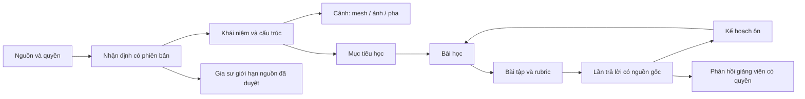

# HumanScope — chiến lược phát triển nền tảng học y có chiều sâu

Ngày nghiên cứu: **01/10/2026**. Phạm vi: nghiên cứu và thiết kế sản phẩm, không thay đổi ứng dụng hoặc triển khai production. Kế thừa [nghiên cứu nguồn 4D](./medical-4d-expansion-2026-10-01.md) và [trạng thái implementation](../implementation/medical-4d-expansion-status.md).

## 1. Định hướng đề xuất

HumanScope nên giúp người học **nhận diện đúng, hiểu cơ chế, vận dụng vào tình huống mới, nhớ lâu và biết giới hạn hiểu biết của mình**. Mô hình toàn thân là điểm vào; nội dung đáng tin, bài tập có phản hồi và bằng chứng tiến bộ mới là giá trị lâu dài.

Mức tham vọng cao: liên kết **giải phẫu → ảnh cắt lớp → mô học → sinh lý → sinh lý bệnh → suy luận ca học tập → giao tiếp → tự đánh giá** trong cùng một hành trình. Mỗi mắt xích cần định danh, nguồn, quyền sử dụng, người duyệt và bài tập tương ứng. Không giả định rằng càng nhiều model hoặc bài viết thì người dùng càng học tốt.

Quyết định đề xuất:

- Chọn sinh viên y giai đoạn nền tảng–chuyển tiếp lâm sàng làm nhóm chính đầu tiên; tiếng Việt chuẩn, thuật ngữ Anh đi kèm. Đây là giả định sản phẩm cần phỏng vấn, không phải nhu cầu đã xác nhận bằng nghiên cứu người dùng.
- Xây một gói tim–phổi thật tốt trước: anatomy có cấu trúc, ảnh nguồn có metadata, chu kỳ hoạt động, bài học giải thích, ôn tập và đo khả năng vận dụng.
- Mở rộng theo **độ sâu đã nghiệm thu**, không theo số cơ quan được gắn nhãn “4D”. Đầu tư biên tập và chuyên gia song song kỹ thuật.
- Giữ Firebase/GCP và giới hạn chi phí đã có. Nội dung ổn định được biên soạn/cache; AI chỉ dùng khi tạo thêm giá trị rõ ràng.

## 2. Phương pháp và mức độ chắc chắn

Đây là nghiên cứu sản phẩm có truy hồi nguồn có chủ đích, **không phải tổng quan hệ thống hoặc đánh giá GRADE**. Tìm nghiên cứu gốc về retrieval practice, anatomy visualization, cognitive load và clinician–AI workflows; đối chiếu tài liệu chính thức WFME, AAMC, NBME, WHO, W3C và trang nhà cung cấp sản phẩm. Không dùng Reddit, bài quảng cáo bên thứ ba hoặc kết quả tìm kiếm không rõ nguồn để suy ra hiệu quả.

Một số PubMed/PMC direct fetch bị rút gọn, CAPTCHA hoặc rate limit: khi chỉ đọc được abstract/indexed abstract, registry ghi đúng mức đó. Nghiên cứu nhỏ, khác quần thể và khác phép đo không được gộp thành một phần trăm hiệu quả HumanScope. Tài liệu vendor chỉ chứng minh tính năng được mô tả, không chứng minh lợi ích giáo dục độc lập.

Repository Intelligence: **DEGRADED** sau refresh; CodeGraph index stale, CocoIndex health chưa sẵn sàng. Dùng đọc source có giới hạn. Không kiểm tra production hoặc thử vượt chặn trình duyệt của lượt trước.

### Những gì đã xác minh ở sản phẩm

- `learning-quiz.ts` chấm số đáp án đúng đã xác nhận trong một lượt. Đây là điểm luyện tập, chưa phải mô hình năng lực dài hạn.
- `medical-english-quiz.ts` tạo bài dịch thuật ngữ từ tập nội dung đã có; distractor được lấy theo thứ tự. Cần biên tập distractor theo hiểu nhầm thực tế trước khi dùng cho đánh giá sâu.
- `quiz-slides.tsx` có lời giải, nguồn và nút quay lại giai đoạn mô phỏng. Đây là nền tảng tốt để liên kết câu sai với cảnh học.
- Các file đã đọc chưa thể hiện lịch ôn cách quãng hay đánh giá transfer/delayed retention. Kết luận này giới hạn trong phạm vi source đã đọc/tìm kiếm.
- Candidate cắt nhiều mặt phẳng có kiểm tra kỹ thuật nhưng chưa đạt nghiệm thu giao diện. IS-A đã có một mesh bổ sung được audit; chưa có toàn bộ gói volume/cine đã duyệt.
- Chưa xác định người phụ trách kiểm duyệt y khoa và chương trình học của đối tác cụ thể.

## 3. Bằng chứng nào thay đổi quyết định thiết kế?

| Bằng chứng nghiên cứu gốc | Kết quả liên quan và giới hạn | Suy luận thiết kế cho HumanScope |
|---|---|---|
| [Larsen 2009, RCT](https://pubmed.ncbi.nlm.nih.gov/19930508/) | 40 bác sĩ nội trú hoàn thành; kiểm tra lặp có phản hồi cho điểm nhớ lại sau hơn 6 tháng cao hơn học lại. Một bối cảnh và ít chủ đề | Cần tự truy hồi trước khi xem lời giải, có ôn lại; không cam kết mức tăng điểm tương tự |
| [Larsen 2013](https://pubmed.ncbi.nlm.nih.gov/23746156/) | 47 sinh viên năm đầu; kiểm tra lặp có lợi cho lưu giữ/vận dụng trong nghiên cứu. Chỉ đối chiếu abstract | Bài luyện cần câu mới kiểm tra cùng cơ chế, không chỉ lặp đúng câu đã thuộc |
| [Koh 2023, nghiên cứu và RCT](https://www.nature.com/articles/s41598-023-35046-2) | Nhánh học gan gồm 46 sinh viên; model tô màu có điểm sau học tốt hơn model photorealistic trong tác vụ đó. Không chứng minh ưu thế mọi cơ quan | Có cả chế độ “Dễ phân biệt” và “Ảnh/mẫu nguồn”; đừng bắt người mới học qua texture phức tạp |
| [RCT stereoscopic AR](https://pubmed.ncbi.nlm.nih.gov/34894205/) | 66 người học; stereoscopic không cải thiện điểm so với monoscopic trong thử nghiệm | VR/headset là hướng sau, không phải điều kiện để có giá trị ban đầu |
| [Khalil và cộng sự](https://pubmed.ncbi.nlm.nih.gov/19177385/) | Các nghiên cứu ảnh cắt lớp không ghi nhận lợi ích nhận diện rõ trong môi trường tự học; vật liệu phức tạp tăng tải nhận thức. Abstract, đối tượng pha trộn | Mở một mặt phẳng có hướng dẫn trước; bốn viewport là tùy chọn, không mặc định cho người mới |
| [Johannessen 2026](https://www.frontiersin.org/journals/psychology/articles/10.3389/fpsyg.2026.1767614/full) | Thử nghiệm nhỏ, 21 sinh viên; mức tăng kiến thức tương đương giữa 2D và VR. Không đủ để kết luận tương đương nói chung | Đo kết quả học và gánh nặng thao tác trước khi chi nhiều cho immersion |
| [Goh 2024, RCT](https://pubmed.ncbi.nlm.nih.gov/39466245/) | 50 bác sĩ; cho truy cập chatbot không làm cải thiện đáng kể suy luận chẩn đoán so với nguồn thông thường trong thiết kế này | Không mặc định “có chatbot” nghĩa là học tốt hơn |
| [Everett 2026, RCT](https://www.nature.com/articles/s41746-026-02545-1) | 70 bác sĩ, chủ yếu nội khoa; workflow AI cộng tác cải thiện điểm ca mô phỏng. Chưa chứng minh duy trì kỹ năng khi bỏ AI hay kết quả người bệnh | Thử coach có quy trình, để người học suy nghĩ rồi so sánh lập luận; kiểm tra lại khi không có AI |

Các lựa chọn sản phẩm cột phải là **suy luận**, chưa phải can thiệp HumanScope đã có hiệu quả. Đặc biệt, fidelity của hình ảnh, độ chính xác giải phẫu và hiệu quả học là ba tiêu chí khác nhau.

## 4. Ai được phục vụ, và phục vụ đến đâu?

| Nhóm | Công việc cần làm tốt hơn | Trải nghiệm phù hợp | Giới hạn |
|---|---|---|---|
| Sinh viên năm đầu | Định hướng, nhận diện, hiểu quan hệ | Mô hình đơn giản, tên Việt–Anh, bài tập tìm/chỉ cấu trúc | Chưa ép suy luận điều trị |
| Sinh viên chuyển tiếp lâm sàng | Liên hệ cấu trúc, ảnh, cơ chế và dữ kiện | Case theo từng bước, giải thích, so sánh mẫu | Không thay thế thực hành người bệnh có giám sát |
| Điều dưỡng, kỹ thuật hình ảnh, phục hồi chức năng | Kiến thức theo vai trò và giao tiếp liên ngành | Lộ trình riêng với giảng viên đúng chuyên môn | Không dùng nguyên curriculum bác sĩ cho mọi nghề |
| Giảng viên | Chuẩn bị bài, giao nhiệm vụ, phát hiện chỗ cả lớp hiểu sai | Lesson builder, scene có phiên bản, rubric và thống kê câu hỏi | Chỉ xem dữ liệu lớp được cấp quyền |
| Bác sĩ muốn ôn tập | Tra cứu có nguồn và luyện suy luận | Nội dung nâng cao có phạm vi/chuyên ngành rõ | Chưa phải decision support cho ca thật |
| Người dân | Hiểu cơ thể và trao đổi tốt hơn với nhân viên y tế | Khu giải thích phổ thông riêng, ngôn ngữ đơn giản | Không trộn bài chẩn đoán/kê đơn chuyên môn vào đường này |

[WFME](https://wfme.org/standards/bme/) là khung chất lượng đào tạo và yêu cầu phù hợp bối cảnh, không phải curriculum chung cho mọi nơi. [AAMC Core EPAs](https://www.aamc.org/about-us/mission-areas/medical-education/cbme/core-epas) hữu ích để tham khảo hành vi nghề nghiệp, nhưng điểm trên website không chứng minh người học được giao làm độc lập. Chưa xác minh đầy đủ văn bản gốc và hiệu lực chuẩn Việt Nam trong lượt này; không tự gắn nhãn “đạt chuẩn Bộ Y tế”.

## 5. Sáu trụ cột nâng cấp

### A. Atlas đa tầng, mỗi tương tác có mục đích

Toàn thân → vùng → cơ quan → cấu trúc → mô/tế bào khi có nguồn. Cho chọn lớp, tìm kiếm Việt/Anh/Latin đã duyệt, isolate, hide, opacity, cắt và reset; lưu cảnh để quay lại. Mỗi cấu trúc mở hồ sơ kiến thức và tác vụ học liên quan.

Hai chế độ hình ảnh: màu phân biệt phục vụ học và hiển thị gần mẫu nguồn phục vụ nhận diện. Màu giả không được ngụ ý mật độ CT, tưới máu hoặc oxy hóa. Khi phóng gần, chuyển LOD có giới hạn; không tự sinh chi tiết giải phẫu không có bằng chứng bằng generative graphics.

Phải phát triển dần mẫu nữ, biến thể giải phẫu và các độ tuổi có dữ liệu đúng. Không thu nhỏ model người lớn thành trẻ em, không coi một mẫu là tất cả cơ thể, không lấy khác biệt nhân khẩu làm suy luận bệnh lý. Tách anatomy variant khỏi pathology.

### B. Phòng đối chiếu ảnh và 4D

MPR có calibration, crosshair, orientation, ảnh gốc/mask; cine tim và CT hô hấp với pha/thời gian xác định. Mỗi liên kết biết rõ cùng mẫu hay khác mẫu. Co-registration phải có provenance và sai số phù hợp mục đích.

Phạm vi mở rộng theo cơ quan:

| Hệ | Chiều sâu hữu ích | Điều kiện dữ liệu |
|---|---|---|
| Tim mạch | Thành/buồng/van, đường dòng máu, cine, liên hệ điện–cơ | Chỉ đồng bộ ECG, áp lực, vận tốc nếu có cùng nguồn hoặc mô phỏng được ghi rõ |
| Hô hấp | Cây phế quản, khoang màng phổi, cơ hoành, pha thở | Không coi CT người bệnh là phổi bình thường; phân biệt chuyển động và trao đổi khí |
| Thần kinh | Đường dẫn truyền, vùng chức năng, tương quan cắt lớp | Không thể hiện bó sợi hay chức năng như đã đo ở mẫu khi chỉ có atlas |
| Cơ xương | Điểm bám, hướng cơ, khớp và giới hạn mô phỏng | Mô hình động học cần source/parameter, không suy chức năng chỉ từ xương |
| Thận–tiết niệu | Cơ quan, nephron, quá trình lọc/điều hòa | Mức vi mô thường là schematic; không gọi là ảnh thực của ca |
| Tiêu hóa–gan | Tương quan, đường dẫn, mô học và cơ chế vận chuyển | Peristalsis/vi tuần hoàn cần mô hình riêng, không lặp scale mesh |
| Sinh sản–phát triển | Mẫu phù hợp giới/tuổi, phôi thai theo giai đoạn | Bộ dữ liệu và duyệt chuyên ngành riêng; quyền và consent đúng phạm vi |
| Da–nội tiết–miễn dịch | Liên kết mô, tế bào, receptor và chức năng | Ưu tiên giải thích đúng hơn chuyển động 3D không mang thêm thông tin |

Danh mục dataset và license ở [registry 4D](./medical-4d-source-registry.json) vẫn là shortlist, chưa là allowlist xuất bản. Phát hiện mẫu NLM chỉ có PNG nhấn mạnh phải kiểm tra byte/metadata trước khi thiết kế tính năng quanh tên dataset.

### C. Thư viện kiến thức có cấu trúc và nguồn đến từng nhận định

Một “hồ sơ cấu trúc” phải trả lời: là gì, ở đâu, liên quan với gì, làm gì, nhận ra trên ảnh thế nào, hay nhầm ở đâu, có biến thể gì, cần học tiếp gì. Nội dung sâu dần qua các lớp: tóm tắt 30 giây → giải thích nền tảng → ảnh/case → tài liệu gốc.

Mỗi nhận định trọng yếu có citation chỉ rõ phiên bản, phần nguồn hỗ trợ, phạm vi mẫu/quần thể và ngày duyệt. Không đặt một link cuối bài để ngụ ý nó hỗ trợ mọi câu. Khi nguồn cập nhật, xác định tất cả bài học/câu hỏi/AI answer dùng nhận định đó để tái duyệt hoặc rút tạm.

Không nhập hàng loạt textbook hoặc guideline chỉ vì truy cập được. Giữ sổ quyền sử dụng cho text, ảnh, model, bản dịch và derivative. Bản Việt cần review ý nghĩa và thuật ngữ, không chỉ sửa văn phong. Hướng dẫn địa phương, guideline quốc tế và bài nghiên cứu gốc có mục đích khác nhau; hiển thị sự khác biệt khi chúng không thống nhất.

### D. Học chủ động, nhớ lâu và biết mình chưa hiểu gì

Chu trình một buổi học dự kiến 10–15 phút, thời lượng cần đo thực:

1. Nêu một mục tiêu quan sát được, ví dụ tìm một cấu trúc ở góc nhìn mới.
2. Câu thử ngắn trước học; có “chưa biết”, không phạt điểm thi.
3. Xem một cảnh có gợi ý; bỏ gợi ý dần.
4. Dự đoán trước khi đổi lát hoặc chạy pha.
5. Trả lời và tự giải thích bằng vài câu.
6. Phản hồi chỉ ra nguyên nhân nhầm; quay về cảnh đúng chỗ đó.
7. Bài transfer với ảnh/góc nhìn khác chưa gặp.
8. Lên lịch ôn lại, cho người học điều chỉnh tải.

Loại bài: tìm trên mô hình, đặt marker có dung sai hợp lý, định hướng mặt phẳng, sắp chuỗi cơ chế, đối chiếu ảnh khác, câu hỏi một đáp án tốt nhất, tự giải thích, đọc–đánh giá nguồn và giải thích lại cho người không chuyên. Chấm marker phải dựa trên cấu trúc/ROI, không chỉ khoảng cách pixel thay đổi theo camera.

Lịch 1–3–7–14–30 ngày chỉ là **preset thử nghiệm**, không phải công thức tối ưu đã chứng minh cho HumanScope. Chỉ xếp lịch sau câu trả lời có ý nghĩa; không dùng thời gian mở tab để xác nhận nhớ. Trạng thái nên là “chưa thử”, “cần ôn”, “đã làm đúng với gợi ý”, “đã làm đúng không gợi ý”, “đã nhớ lại sau khoảng nghỉ”; tránh phần trăm “thành thạo” giả chính xác.

Ghi mức tự tin để phát hiện “sai nhưng rất chắc”; dùng phản hồi hỗ trợ, không dán nhãn năng lực thấp. Để người học tự chọn mục tiêu, quay lại nền tảng và xem lý do bài được đề xuất. Không dùng streak gây áp lực hoặc leaderboard công khai về năng lực y khoa.

### E. Ca học tập và suy luận có phản biện

Case được tiết lộ theo từng bước: câu hỏi → dữ kiện mới → nhận định ban đầu → bằng chứng ủng hộ/chống → lựa chọn thông tin cần thêm → đối chiếu lời giải của giảng viên. Có ca không đủ dữ kiện; chấp nhận câu “chưa đủ kết luận” khi rubric quy định.

Ngân hàng câu hỏi cần blueprint theo mục tiêu và mức độ, distractor từ lỗi hiểu biết có thật, giải thích vì sao đáp án khác không phù hợp trong bối cảnh. Học từ hướng dẫn biên soạn của [NBME](https://www.nbme.org/institutions/nbme-item-writing-guide/) nhưng tự viết nội dung có quyền sử dụng; không sao chép câu thi bảo mật. Phân biệt lượt luyện có gợi ý với lượt đánh giá giữ kín đáp án; review item sau khi đủ dữ liệu, không kết luận chất lượng câu hỏi từ vài lượt làm.

Case tổng hợp cần ghi rõ là tổng hợp; case nguồn cần consent/quyền và de-identification. Không tạo “ca thật” bằng AI rồi giả dữ kiện bệnh viện. Kỹ năng giao tiếp có rubric giảng viên: giải thích ngắn, kiểm tra người nghe hiểu, trình bày điều chưa chắc. Chưa cung cấp hướng dẫn cá nhân hóa cho người bệnh thật trong gói đầu.

### F. Gia sư AI có nguồn, giúp người học tự suy nghĩ

Vai trò ban đầu: giải thích lại nội dung đã duyệt, gợi ý câu hỏi, so sánh câu trả lời của người học với rubric, trỏ về cảnh/nguồn và hỗ trợ thuật ngữ. Không giao AI làm người duyệt cuối, không tự tạo/sửa clinical facts hoặc điểm chứng nhận.

Workflow đề xuất: người học trả lời trước → truy hồi nội dung approved đúng version/locale/level → gợi ý ngắn có citation → yêu cầu tự sửa → bài tương tự không AI. Chọn workflow này vì mục tiêu học độc lập; nghiên cứu clinician–AI nêu trên không chứng minh nó là tốt nhất cho sinh viên.

RAG không đảm bảo đúng. Cần kiểm thử citation có thật và hỗ trợ câu trả lời, phát hiện nội dung rút quyền, mâu thuẫn phiên bản, thiếu nguồn, prompt injection trong tài liệu và câu hỏi vượt phạm vi. Khi không đủ chứng cứ, trả lời giới hạn và dẫn nguồn/giảng viên, không bịa tiếp. Mô hình không có quyền publish, thay review state, truy cập hồ sơ người khác hoặc tự mua dịch vụ.

Tham khảo [WHO về LMM trong y tế](https://www.who.int/publications/b/70584) cho governance và human oversight; đây là nguồn định hướng, không phải chứng nhận sản phẩm. Nội dung WHO có điều kiện sử dụng riêng, không mặc định có thể republish thương mại.

## 6. Luồng sản phẩm và accessibility

Home sau đăng nhập nên có một hành động tiếp theo rõ: bài đang học, phần cần ôn hoặc tự khám phá. Tra cứu công khai không bắt đăng nhập; lưu tiến độ mới cần tài khoản. Navigation: Khám phá, Học theo lộ trình, Luyện tập, Thư viện, Tiến độ; khu giảng viên riêng theo quyền.

Màn hình học giữ mô hình và nhiệm vụ cạnh nhau, nguồn mở theo yêu cầu. Người mới chỉ thấy lớp cần thiết; chuyên sâu có thêm điều khiển. Mỗi thao tác tự động như đưa camera hoặc chạy pha có thể dừng/quay lại. Trạng thái thiếu dữ liệu nói rõ phần nào còn xem được.

[WCAG 2.2](https://www.w3.org/TR/WCAG22/) là đích accessibility: hỗ trợ bàn phím, focus rõ, phương án không cần kéo cho thao tác phù hợp, phụ đề/transcript, không dùng màu làm tín hiệu duy nhất, giảm chuyển động và target đủ dùng. Mô hình 3D cần danh sách cấu trúc và mô tả quan hệ bằng văn bản làm đường thay thế. Không coi bảng text tương đương toàn bộ năng lực không gian; đánh giá riêng giới hạn tiếp cận.

Offline chỉ cache những nội dung được quyền lưu, có version/expiry. Khi mất mạng, cho học phần đã tải và báo trạng thái lưu tiến độ. Không silently tải lại volume lớn trên mạng di động; cho chọn chất lượng và biết dung lượng trước tải.

## 7. So sánh sản phẩm để tìm chỗ khác biệt

| Nguồn vendor đã kiểm tra | Điều đáng học | Khoảng HumanScope cần tự kiểm chứng |
|---|---|---|
| [Complete Anatomy](https://www.elsevier.com/products/complete-anatomy) | Liên kết thao tác atlas với học liệu/giảng dạy | UX web nhẹ, tiếng Việt, bài tập cơ chế và khả năng học trên máy phổ thông |
| [AMBOSS](https://www.amboss.com/us/students/exams) | Câu hỏi, thư viện và phản hồi tiến độ trong một hành trình | Mapping từng câu sai về scene/lát/pha và mục tiêu cụ thể |
| [RADPrimer](https://www.elsevier.com/en-gb/products/radprimer) | Curriculum đọc ảnh và theo dõi học tập theo chủ đề | Slice Lab có hướng dẫn từ anatomy cơ bản lên ảnh mới |

Không sao chép nội dung/asset của họ; không suy ra ưu thế hiệu quả hoặc rẻ hơn khi chưa dùng thử và đo. Khác biệt đề xuất là **kiến thức tiếng Việt có nguồn, trải nghiệm đa phương thức liên kết và tiến bộ đo được**, không phải claim “nhiều model nhất”.

## 8. Kiến trúc tri thức và dữ liệu học

Đây là quan hệ logic, **không cần thêm graph database**. Giữ Firebase Auth, API hiện có, Firestore metadata và object storage cho asset. Dùng các trường ID và index có mục đích; không gửi toàn bộ knowledge graph xuống browser. Chỉ cân nhắc dịch vụ search chuyên dụng khi đo cho thấy catalog/index hiện có không đủ.

| Entity đề xuất | Trường quan trọng |
|---|---|
| `Concept` | ID nội bộ, FMA/FJ/thuật ngữ mappings có chứng cứ, synonym theo locale; không ép mappings 1:1 |
| `ClaimVersion` | nội dung, phạm vi, source đoạn/trang, quyền, người duyệt, ngày hiệu lực, supersedes/withdrawn |
| `LearningObjective` | hành động quan sát được, điều kiện, rubric, prerequisite, nhóm người học |
| `SceneVersion` | asset versions, specimen/spatial/time identity, layers, view và phần dữ liệu thiếu |
| `LessonVersion` | objectives, steps, source/scene bindings, author/reviewer, độ sâu và lịch sử thay đổi |
| `ItemVersion` | objective, response type, distractor rationale, correct/rubric, misconception tags, source claim IDs |
| `Attempt` | pseudonymous learner, item version, initial/final answer, hint use, optional confidence, event ID/time |
| `ReviewPlan` | objective, last evidence, next review, scheduling rationale, user-adjusted load |
| `CohortAssignment` | giảng viên/lớp/quyền, lesson version, deadline nếu có; không mở quyền toàn tổ chức mặc định |

API dự kiến: catalog objectives/lessons, submit attempt idempotent, fetch next review, save scene, teacher aggregate và feedback. Giữ server kiểm tra quyền/ownership/allowlist. Lượt quiz hiển thị lời giải không được tái sử dụng làm điểm thi bảo mật. Không đưa đáp án hoặc rubric giữ kín vào client trước khi submission nếu cần assessment integrity.

Ôn tập và tính điểm cơ bản chạy deterministic, không cần gọi LLM. Không ghi Firestore theo từng frame/camera drag; lưu checkpoint và câu trả lời. Retry offline theo event ID, kiểm tra chủ sở hữu, không hợp nhất dữ liệu hai tài khoản. Export/delete tiến độ có ranh giới rõ; giáo viên chỉ xem dữ liệu được cho phép. Không dùng lịch sử học bệnh hoặc hội thoại cá nhân để nhắm quảng cáo.

## 9. Chất lượng thông tin và vận hành biên tập

Workflow: đề cương → kiểm tra nguồn/quyền → tác giả chuyên môn → reviewer độc lập đúng lĩnh vực → review ngôn ngữ/UX → QA liên kết model/ảnh → publish version → phản hồi/giám sát thay đổi → revise hoặc withdraw. Chỉnh citation/đáp án có thể làm mất hiệu lực review cũ; cần impact graph để xử lý.

Phân mức rủi ro biên tập nội bộ, không gọi là GRADE:

- Cơ bản: danh tính cấu trúc, vị trí, quan hệ; reviewer giải phẫu.
- Trung gian: sinh lý, cơ chế, diễn giải ảnh và bệnh học; reviewer chuyên ngành tương ứng.
- Cao: quyết định lâm sàng, thủ thuật, thông số điều trị; chưa phát hành nếu thiếu governance/phạm vi/đối tác phù hợp.

Mỗi nội dung public phải có owner, nguồn/quyền, phạm vi, review version và cơ chế báo lỗi. Lịch kiểm tra 6/12 tháng hoặc ngắn hơn theo độ biến động là **policy đề xuất**, không thay thế cập nhật theo sự kiện nguồn. Khi có vấn đề nguy hiểm, ưu tiên rút phần bị ảnh hưởng, giữ thông báo và audit; không đợi đủ chu kỳ định kỳ.

## 10. Gói đầu đủ sâu để kiểm chứng

Đề xuất **30 hồ sơ cấu trúc, 12 bài học, 60 bài tập được biên tập**, tập trung tim–phổi và các kỹ năng nền. Các con số là giới hạn pilot, chưa phải nội dung đã có. [Curriculum cụ thể](./medical-learning-pilot-curriculum.csv) nêu từng mục tiêu, loại bài và dependency.

Một bài điển hình về tuần hoàn có năm phần: định hướng → tự chỉ đường đi trên scene được duyệt → phân biệt ảnh/cảnh minh họa → giải thích bằng lời → áp dụng sang góc nhìn mới. Tránh đưa ECG, flow và áp lực vào cùng timeline nếu không có nguồn chứng minh sự đồng bộ.

Sau pilot, mở rộng 3 tầng:

1. **Nền tảng vững:** atlas đầy đủ hơn, citation, quiz có giải thích, lịch ôn, terminology, offline và accessibility.
2. **Vận dụng sâu:** Slice Lab/4D có nguồn, ca từng bước, rubric, misconception feedback và giảng viên.
3. **Hệ sinh thái:** chuyên ngành, mô học, model cơ học/sinh lý, giao tiếp, coach AI đã đánh giá, export/LMS và nghiên cứu hiệu quả.

VR, haptic, digital twin bệnh nhân và đánh giá chứng chỉ thuộc hướng dài hạn với business case và thẩm định riêng. Không có lý do xây chúng trước khi chứng minh web giúp học tốt.

## 11. Ưu tiên đầu tư và điều kiện chấp nhận

| Thứ tự | Hạng mục | Vì sao ưu tiên | Điều kiện qua gate |
|---|---|---|---|
| 1 | Hội đồng nội dung nhỏ, nguồn/claim/version và 30 hồ sơ | Mọi tính năng sau cần tri thức đáng tin | 100% nội dung pilot có quyền và reviewer xác thực |
| 2 | Bài học có mục tiêu, feedback và ôn lại | Tận dụng quiz/scene đã có, kiểm tra lợi ích sớm | Bài sai dẫn về đúng nguồn/cảnh; scheduled review không lộ sai dữ liệu |
| 3 | Hoàn tất QA atlas/cắt và một pack ảnh đúng | Đảm bảo người học thao tác dễ và đối chiếu đúng | UI chưa có evidence vẫn không được gọi hoàn thiện; metadata ảnh đủ |
| 4 | Tim/phổi theo pha + bài transfer | Tăng hiểu cơ chế theo thời gian | Phase/source matching, scope label và expert review |
| 5 | Lesson builder, lớp và phản hồi | Giảng viên đưa công cụ vào quá trình học thật | Version pinning, privacy/permission và aggregate phù hợp |
| 6 | AI coach + specialization | Có corpus/rubric tốt để giới hạn AI | Kiểm thử độc lập nguồn, unsafe answer, abstention và học không AI |

Không trì hoãn nội dung đến sau render hoàn hảo. Có thể chạy song song biên tập và pipeline kỹ thuật nhưng không tăng số cơ quan trước năng lực duyệt.

## 12. Đo giá trị thay vì đo độ bận

**Chỉ số chính đề xuất:** tỷ lệ người học hoàn thành tác vụ mới không gợi ý sau khoảng nghỉ, theo từng mục tiêu học. Tách recall, spatial transfer, explanation và image interpretation; không cộng thành một “điểm bác sĩ” tổng quát.

Chỉ số phụ: mức sai nhưng tự tin cao, số hint cần dùng, khả năng giải thích quan hệ, thời gian hoàn thành đúng, usability, nội dung báo sai, tỷ lệ citation hỗ trợ đúng nhận định và chi phí mỗi mục tiêu được học thành công. Time-on-site, lượt xoay và số câu AI trả lời chỉ là hoạt động.

Thiết kế đánh giá:

- Vòng định tính đề xuất 8–12 người học và 2–3 giảng viên, có người dùng máy yếu/bàn phím; dùng để tìm lỗi và phỏng vấn, không chứng minh hiệu quả.
- Pilot so sánh cùng thời lượng/cùng nội dung với phương pháp hiện tại; randomize hoặc counterbalance khi phù hợp, ghi baseline và mức biết trước.
- Đánh giá ngay sau học và sau 7/30 ngày bằng câu/ảnh giữ lại chưa luyện. Các mốc là kế hoạch đo, chưa là lịch tối ưu.
- Người chấm rubric không biết nhóm khi khả thi; double-score một phần, báo đồng thuận, missingness, attrition, effect size và khoảng tin cậy.
- Tính cỡ mẫu trước nghiên cứu xác nhận từ primary endpoint và hiệu quả nhỏ nhất đáng quan tâm; không lấy 10 người làm căn cứ marketing cải thiện học tập.
- Nếu nghiên cứu để công bố hoặc thu thập dữ liệu nhạy cảm, để đơn vị nghiên cứu quyết định ethics/consent theo quy định áp dụng. Không tự gọi analytics sản phẩm là thử nghiệm lâm sàng.

AI cần một bộ đánh giá giữ riêng, do chuyên gia viết: nhận định sai, nguồn mâu thuẫn/rút quyền, tiếng Việt/Anh, câu hỏi thiếu dữ kiện, prompt injection, đề nghị tư vấn cá nhân và câu hỏi không có trong corpus. Đánh giá citation entailment, mức độ đúng, tác hại và khả năng từ chối phù hợp, không chỉ điểm similarity.

## 13. Nguồn lực và chi phí

Chi phí khó thay thế nhất là chuyên môn và biên tập. Ước lượng năng lực nội bộ để lập kế hoạch, **không phải báo giá**: 30 hồ sơ × 45–90 phút + 12 bài × 2–4 giờ + 60 item × 20–40 phút = **66,5–133 giờ** cho một lượt tác nghiệp giả định. Chưa gồm independent review, sửa sai, dịch, asset QA, lập trình và research. Phải đo time-per-item thực trước khi tăng lên hàng nghìn nội dung.

Vai trò cần có: content lead, giảng viên giải phẫu, reviewer imaging/sinh lý phù hợp từng pack, biên tập Việt–Anh, frontend/3D/data và QA. Một người có thể kiêm vai trò nhưng không nên tự duyệt mọi nội dung rủi ro mình viết. TODO(owner): người cụ thể và ngân sách chuyên môn.

Giữ chi phí cloud bằng lazy assets, LOD, giới hạn volume cache, precompute offline, cache bài học và không gọi AI cho câu hỏi cố định. Công thức ngân sách: storage + bytes/session × sessions + API/database operations + AI tokens × unit price + reviewer/content/licenses. Không đặt 650 USD/tháng thành mục tiêu phải tiêu; không hứa “maximum” không giới hạn trên hạ tầng rẻ.

Monetization nên bán giá trị: gói học liệu đã biên tập, quyền giảng viên/lớp, pack chuyên sâu hoặc công cụ soạn bài. Ad chỉ ở nơi không phá học tập và không ảnh hưởng xếp hạng nguồn. Không trả tiền để mua đáp án y khoa thiên lệch, không hứa cloud/AI vô hạn cho license một lần.

## 14. Triển khai, rollback và phần chưa biết

Đây là nghiên cứu mở rộng chiến lược, chưa phải chỉ thị sửa mọi module. Implementation trước vẫn giữ trạng thái candidate và các blocker; tài liệu này không xóa chúng. Mỗi giai đoạn cần plan theo file, migration additive, feature flag và kiểm tra tương thích.

Lộ trình kỹ thuật: nội dung versioned qua API hiện có → attempts/review schedule → scene/objective mapping → Slice/4D packs → teacher tooling → AI. Rollback bằng tắt pack/feature và đổi published-version pointer; giữ audit và attempt version để không chấm lại lịch sử bằng đáp án mới. Nếu item sai, ghi đính chính và xử lý điểm minh bạch, không silently viết lại kết quả.

Observability: content-version load errors, broken source links, retrieval misses, privacy-safe wrong-item reports, bytes/session, latency và chi phí; không gửi câu trả lời/hội thoại định danh sang quảng cáo. Alerts về nguồn hết hạn cần người chịu trách nhiệm, không tự động publish bản AI viết lại.

TODO(owner): đối tác trường/lớp thử nghiệm; nhóm ưu tiên; reviewer và quyền xuất bản; curriculum Việt Nam; thiết bị tối thiểu; ngân sách nội dung; phạm vi dữ liệu học được giữ; tư cách chứng nhận nếu tương lai muốn cấp tín chỉ. Không có blocker nào trong số đó ngăn hoàn thành nghiên cứu này, nhưng chúng ảnh hưởng trực tiếp đến triển khai và tuyên bố hiệu quả.

## 15. Kết quả nghiên cứu và giới hạn bàn giao

Đã hoàn thành chiến lược, evidence registry, curriculum pilot, kiến trúc tri thức/tiến độ, governance, roadmap và thiết kế đo hiệu quả. Không có claims cải thiện thực tế trên người dùng HumanScope; không thêm nội dung y khoa public, code, cloud hoặc model mới trong lượt này. Browser blocker trước đây không cản nghiên cứu tài liệu và cũng chưa được giải quyết.

Tài liệu kèm: [registry bằng chứng](./medical-learning-evidence.json), [curriculum pilot](./medical-learning-pilot-curriculum.csv), [review nghiên cứu](./medical-learning-research-review.md).
